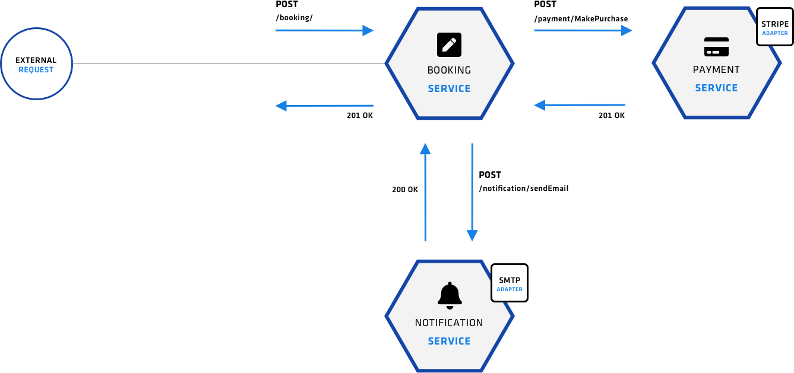

# Cinemas Microservice in Go (Project)



This project consist of the following components:

```
.
├── base_docker_image
├── booking-service
├── cinemas-db
├── deploy
│   ├── docker-compose
│   ├── hashicorp
│   │   ├── Vagrantfile
│   │   ├── deployment-files
│   │   ├── provision
│   │   │   ├── consul
│   │   │   ├── docker-config
│   │   │   ├── nomad
│   │   │   ├── scripts
│   │   │   └── vault
│   └── readme.md
├── movie-service
├── notification-service
└── payment-service
```

- 4 microservices written in Go
- 1 mongodb replica set cluster
- 2 deployment strategies
  - docker-compose strategy for local testing
  - hashicorp stack strategy for local cloud simulation testing


# Steps to initialize the environment

**1.- Initialize VMs** by positioning in the terminal where the `Vagrantfile` is located, the start the vm's by the following command:
- ```
  $ vagrant up
  ```
---
**2.- Bootstrap Consul ACL**
  - Note: This step should be run inside the VM
    ```
    $ vagrant ssh dc1-consul-server
    ```
  - Then run the following script:
  - ```
    $ bash /vagrant/provision/consul/acl/bootstrap.sh
    ```
---

**3.- Set Root Token to agent -  (embbeded in prev step)**
- To set tokens in consul you can run the following command:
  ```
  $ consul acl set-agent-token default [token]
  ```

---
**4.- Create Consul Policies**

- **(requires consul_http_token)** - execute it outside the VM
- Terraform script (/provision/consul/acl) 
- ```
  $ CONSUL_HTTP_TOKEN=... terraform apply -auto-approve
  ```
---
**5.- Unseal Vault**

- ```
  $ bash /vagrant/provision/vault/system/vault-config.sh
  ```
- inside the VM
---
**6.- Create Vault Policies for apps**
- **(requires vault_addr & vault_token & consul_http_token)** - execute it outside the VM
- Terraform script (/provision/vault/policies) 
- ```
  $ CONSUL_HTTP_TOKEN=... VAULT_ADDR=... VAULT_TOKEN=... terraform apply -auto-approve
  ```
---
**7.- Create Vault Apps Secrets & Enable Consul Secrets engine**
- **(requires vault_token & consul_http_token)**
- ```
  $ CONSUL_HTTP_TOKEN=... VAULT_TOKEN=... bash /vagrant/provision/vault/secrets/secrets.sh
  ```
---
**8.- Create Vault Roles with Consul Policies**
  - **(requires vault_token)**
  - ```
    $  VAULT_TOKEN=... bash /vagrant/provision/vault/secrets/consul-roles.sh
    ```
---
**9.- Generate Vault Token for consul agents**

- **(requires vault_token & consul role as argument )**
- ```
  $ VAULT_TOKEN=... bash /vagrant/provision/vault/secrets/consul-get-token.sh operator-prefix
  ```
---
**10.- Change ACL config from "allow" -> "deny"**
- (work arround fix for envoy authentication when ACL are enabled)
- use editor of preference vi | nano | pico
- ```
  $ nano /var/consul/config/consul-config.hcl
  ```
---
**11.- Implement New Consul Token to agent(s)**
  - via config file (option 1)
  - via cli (option 2 - best-practice)
  ```
  $ consul acl set-agent-token default [token generated from vault from step 9]
  ```

## Pre-requisits to have before deploying the services

**12.- Create Prepared Queries for DC1 and DC2** - execute it outside the VM
- **(requires consul_http_token)**
- Terraform script (/provision/consul/prepared-queries/dc1 and /dc2) 
- ```
  $ CONSUL_HTTP_TOKEN=...  terraform apply -auto-approve
  ```

**13.- Create Intentions on Primary DC** - execute it outside the VM \
(Optional in this step or apply it when all services has been deployed)
- **(requires consul_http_token)**
- Terraform script (/provision/consul/intentions) 
- ```
  $ CONSUL_HTTP_TOKEN=...  terraform apply -auto-approve

**14.- Deploy Cinemas Database** 
- The microservices needs a MongoDB Cluster up and running in order to start
so is required to have the MongoDB Cluster up and running and also the prepared queries to be created in consul, since the applications are pointing to the mongodb prepared queries url. To get the mongo cluster up running please followup. [Mongodb Deployment Process Document.](./documentation/mongodb.md)


