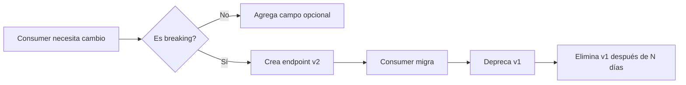

# Contract Tests - Cinema Microservices

Este documento describe la estrategia de Contract Testing para el sistema de reservas de cine, basada en **Consumer-Driven Contract Testing** con [Pact](https://pact.io/).

---

## Tabla de Contenidos

1. [Por Qué Contract Testing](#por-qué-contract-testing)
2. [Beneficios](#beneficios)
3. [Arquitectura de Contract Testing](#arquitectura-de-contract-testing)
4. [Resumen de Contratos del Sistema Cinema](#resumen-de-contratos-del-sistema-cinema)
5. [Cómo Ejecutar los Tests](#cómo-ejecutar-los-tests)
6. [Integración con Harness CI](#integración-con-harness-ci)
7. [Best Practices de la Industria](#best-practices-de-la-industria)
8. [Pact Broker (Opcional)](#pact-broker-opcional)
9. [Troubleshooting](#troubleshooting)

---

## Por Qué Contract Testing

En arquitecturas de microservicios, los servicios se comunican entre sí a través de APIs. Esto genera varios desafíos:

| Problema | Descripción |
|----------|-------------|
| **Acoplamiento invisible** | Un cambio en el API de un servicio puede romper otros servicios sin que lo sepamos hasta producción |
| **Tests E2E frágiles** | Los tests end-to-end son lentos, difíciles de mantener y propensos a falsos negativos |
| **Despliegues arriesgados** | Sin garantías de compatibilidad, cada deploy es un riesgo de regresión |
| **Coordinación entre equipos** | Múltiples equipos deben sincronizarse para cambios de API |

**Contract Testing resuelve estos problemas** verificando que los servicios cumplen con las expectativas acordadas (contratos) sin necesidad de ejecutar todos los servicios simultáneamente.

### ¿Qué es un Contrato?

Un contrato define:
- **Qué espera el consumer** (cliente) del provider (servidor)
- **Qué respuestas debe dar el provider** para cada request
- **Las reglas de validación** (tipos, formatos, valores permitidos)

---

## Beneficios

### Para el Desarrollo

- **Feedback rápido**: Detecta incompatibilidades de API en segundos, no en minutos de tests E2E
- **Desarrollo independiente**: Los equipos pueden trabajar en paralelo sin depender de otros servicios
- **Documentación viva**: Los contratos sirven como especificación actualizada del API
- **Confianza en refactoring**: Cambios internos que no afectan el contrato son seguros

### Para el Negocio

- **Reducción de incidentes**: Previene roturas de integración en producción
- **Time-to-market más rápido**: Menos tiempo en debugging de integración
- **Menor costo de testing**: Reduce dependencia de ambientes costosos de integración

### Comparación con Otras Estrategias

| Estrategia | Velocidad | Confiabilidad | Costo | Scope |
|------------|-----------|---------------|-------|-------|
| Unit Tests | Muy rápido | Alta | Bajo | Código aislado |
| **Contract Tests** | Rápido | Alta | Bajo | Integraciones API |
| Integration Tests | Medio | Media | Medio | Servicios reales |
| E2E Tests | Lento | Baja | Alto | Sistema completo |

---

## Arquitectura de Contract Testing

```
┌─────────────────────────────────────────────────────────────────────────────┐
│                        CONSUMER-DRIVEN CONTRACT FLOW                        │
├─────────────────────────────────────────────────────────────────────────────┤
│                                                                             │
│  ┌─────────────────────┐                      ┌──────────────────────────┐ │
│  │                     │      generates       │                          │ │
│  │   Consumer Tests    │ ──────────────────► │     Pact Contracts       │ │
│  │  (booking-service)  │                      │      (JSON files)        │ │
│  │                     │                      │                          │ │
│  │  - Define expected  │                      │  - Machine-readable      │ │
│  │    requests         │                      │  - Versioned             │ │
│  │  - Define expected  │                      │  - Self-documenting      │ │
│  │    responses        │                      │                          │ │
│  └─────────────────────┘                      └───────────┬──────────────┘ │
│                                                           │                 │
│                                                           │ verifies        │
│                                                           ▼                 │
│                                               ┌──────────────────────────┐ │
│                                               │                          │ │
│                                               │    Provider Tests        │ │
│                                               │    (each service)        │ │
│                                               │                          │ │
│                                               │  - Replay interactions   │ │
│                                               │  - Validate responses    │ │
│                                               │  - State handlers        │ │
│                                               └──────────────────────────┘ │
│                                                                             │
└─────────────────────────────────────────────────────────────────────────────┘
```

### Flujo de Trabajo

1. **Consumer escribe tests**: Define qué espera del provider
2. **Se generan contratos**: Archivos JSON con las interacciones esperadas
3. **Provider verifica**: Ejecuta los contratos contra su implementación real
4. **CI/CD valida**: Ambos lados deben pasar antes de desplegar

---

## Resumen de Contratos del Sistema Cinema

El sistema Cinema utiliza `booking-service` como el principal consumer que orquesta las reservas de boletos.

### Matriz de Contratos

| Consumer | Provider | Descripción | Interacciones |
|----------|----------|-------------|---------------|
| `booking-service` | `payment-service` | Procesamiento de pagos | 3 |
| `booking-service` | `seat-service` | Gestión de asientos | 5 |
| `booking-service` | `showtime-service` | Información de funciones | 4 |
| `booking-service` | `notification-service` | Envío de emails | 3 |

---

### Contrato: booking-service → payment-service

**Propósito**: Procesar pagos y reembolsos para las reservas de boletos.

| Interacción | Método | Endpoint | Descripción |
|-------------|--------|----------|-------------|
| Successful Payment | `POST` | `/payment/makePurchase` | Procesa pago con tarjeta válida |
| Invalid Amount | `POST` | `/payment/makePurchase` | Rechaza montos inválidos (0 o negativos) |
| Refund | `POST` | `/payment/{id}/refund` | Procesa reembolso de cargo existente |

**Request de Pago (ejemplo)**:
```json
{
  "userName": "John Doe",
  "currency": "mxn",
  "number": "4242424242424242",
  "cvc": "123",
  "exp_month": "12",
  "exp_year": "2026",
  "amount": 450,
  "description": "Ticket(s) for showtime sht_abc123"
}
```

**Response Exitoso**:
```json
{
  "user": "John Doe",
  "amount": 450,
  "charge": {
    "id": "ch_test123",
    "amount": 45000,
    "currency": "mxn",
    "status": "succeeded",
    "receipt_url": "https://pay.stripe.com/receipts/abc"
  }
}
```

---

### Contrato: booking-service → seat-service

**Propósito**: Gestionar holds temporales y reservas permanentes de asientos.

| Interacción | Método | Endpoint | Descripción |
|-------------|--------|----------|-------------|
| Verify Hold | `GET` | `/seats/hold/{hold_id}` | Verifica que un hold existe y es válido |
| Hold Expired | `GET` | `/seats/hold/{hold_id}` | Maneja holds expirados (404) |
| Reserve Seats | `POST` | `/seats/reserve` | Confirma reserva tras pago exitoso |
| Reserve Expired | `POST` | `/seats/reserve` | Rechaza reserva con hold expirado |
| Release Hold | `DELETE` | `/seats/hold/{hold_id}` | Libera asientos (compensación por fallo) |

**Flujo típico**:
```
1. Usuario selecciona asientos → seat-service crea HOLD (5 min TTL)
2. Usuario paga → booking-service verifica HOLD
3. Pago exitoso → booking-service confirma RESERVATION
4. Si falla → booking-service libera HOLD
```

---

### Contrato: booking-service → showtime-service

**Propósito**: Obtener información de funciones de cine para validar y mostrar detalles.

| Interacción | Método | Endpoint | Descripción |
|-------------|--------|----------|-------------|
| Get Showtime | `GET` | `/showtimes/{id}` | Obtiene detalles de una función |
| Cancelled Showtime | `GET` | `/showtimes/{id}` | Maneja funciones canceladas |
| Not Found | `GET` | `/showtimes/{id}` | Maneja funciones inexistentes |
| List by Movie | `GET` | `/showtimes?movie_id={id}` | Lista funciones de una película |

**Response de Showtime**:
```json
{
  "id": "sht_abc123",
  "movie_id": "mov_test123",
  "cinema_id": "cin_test",
  "room_number": 5,
  "start_time": "2024-12-20T19:30:00Z",
  "end_time": "2024-12-20T22:00:00Z",
  "available_seats": 100,
  "status": "scheduled"
}
```

---

### Contrato: booking-service → notification-service

**Propósito**: Enviar confirmaciones de reserva por email.

| Interacción | Método | Endpoint | Descripción |
|-------------|--------|----------|-------------|
| Send Confirmation | `POST` | `/notification/sendEmail` | Envía email de confirmación |
| Invalid Email | `POST` | `/notification/sendEmail` | Rechaza emails inválidos |
| Service Unavailable | `POST` | `/notification/sendEmail` | Maneja degradación graceful (503) |

**Request de Email**:
```json
{
  "booking_id": "bkg_abc123",
  "showtime_id": "sht_test",
  "reservation_id": "res_xyz",
  "movie_title": "Dune Part Two",
  "cinema_name": "Cinepolis Reforma",
  "room_number": 5,
  "start_time": "2024-12-20T19:30:00Z",
  "seats": ["A1", "A2"],
  "total_amount": 450,
  "order_id": "ch_abc123",
  "receipt_url": "https://pay.stripe.com/receipts/test",
  "user_name": "John Doe",
  "email": "john@example.com"
}
```

---

## Cómo Ejecutar los Tests

### Prerequisitos

```bash
# Instalar pact-go CLI (requiere sudo)
go install github.com/pact-foundation/pact-go/v2@latest
sudo pact-go install
```

### Ejecutar Consumer Tests

```bash
# Desde el directorio de booking-service
cd services/booking

# Ejecutar todos los consumer tests (genera archivos .json en /contracts)
go test -v ./contracts/consumer/...

# Ejecutar solo un contrato específico
go test -v ./contracts/consumer/... -run TestBookingPaymentContract
go test -v ./contracts/consumer/... -run TestBookingSeatContract
go test -v ./contracts/consumer/... -run TestBookingShowtimeContract
go test -v ./contracts/consumer/... -run TestBookingNotificationContract
```

### Verificar Provider

```bash
# 1. Iniciar el payment-service
cd services/payment
go run cmd/payment/main.go &

# 2. Ejecutar verificación
PACT_PROVIDER_VERIFICATION=true \
PROVIDER_URL=http://localhost:3001 \
go test -v ./contracts/provider/...
```

### Archivos Generados

Después de ejecutar los consumer tests:

| Archivo | Contrato |
|---------|----------|
| `booking-service-payment-service.json` | booking → payment |
| `booking-service-seat-service.json` | booking → seat |
| `booking-service-showtime-service.json` | booking → showtime |
| `booking-service-notification-service.json` | booking → notification |

---

## Integración con Harness CI

Harness CI permite ejecutar contract tests de forma eficiente con soporte para **Test Intelligence**, que optimiza qué tests ejecutar basándose en los cambios del código.

### Pipeline YAML con Test Intelligence

```yaml
pipeline:
  name: Contract Tests
  identifier: contract_tests
  projectIdentifier: cinema_microservices
  orgIdentifier: default
  tags: {}
  
  properties:
    ci:
      codebase:
        connectorRef: github_connector
        repoName: cinema-microservices
        build: <+input>

  stages:
    - stage:
        name: Consumer Tests
        identifier: consumer_tests
        type: CI
        spec:
          cloneCodebase: true
          infrastructure:
            type: KubernetesDirect
            spec:
              connectorRef: k8s_connector
              namespace: harness-builds
              automountServiceAccountToken: true
          execution:
            steps:
              - step:
                  type: RestoreCacheGCS
                  name: Restore Go Cache
                  identifier: restore_cache
                  spec:
                    connectorRef: gcp_connector
                    bucket: harness-cache
                    key: go-mod-{{ checksum "go.sum" }}
                    archiveFormat: Tar
              
              - step:
                  type: Run
                  name: Install Pact
                  identifier: install_pact
                  spec:
                    connectorRef: dockerhub
                    image: golang:1.22-alpine
                    shell: Sh
                    command: |
                      apk add --no-cache curl bash
                      go install github.com/pact-foundation/pact-go/v2@latest
                      pact-go install
              
              - step:
                  type: RunTests
                  name: Consumer Contract Tests
                  identifier: consumer_contract_tests
                  spec:
                    connectorRef: dockerhub
                    image: golang:1.22-alpine
                    language: Go
                    buildTool: Go
                    args: "-v ./contracts/consumer/..."
                    packages: ./services/booking/contracts/consumer
                    runOnlySelectedTests: true  # Test Intelligence
                    enableTestSplitting: false
                    testReportPaths:
                      - "**/*-junit.xml"
                    envVariables:
                      PACT_DIR: /harness/contracts
                      CGO_ENABLED: "0"
                    reports:
                      type: JUnit
                      spec:
                        paths:
                          - "**/*-junit.xml"
              
              - step:
                  type: SaveCacheGCS
                  name: Save Go Cache
                  identifier: save_cache
                  spec:
                    connectorRef: gcp_connector
                    bucket: harness-cache
                    key: go-mod-{{ checksum "go.sum" }}
                    sourcePaths:
                      - /go/pkg/mod
                    archiveFormat: Tar
              
              - step:
                  type: Run
                  name: Upload Pact Files
                  identifier: upload_pacts
                  spec:
                    shell: Sh
                    command: |
                      echo "Pact files generated:"
                      ls -la contracts/*.json || echo "No pact files found"
        
        variables:
          - name: CONTRACTS_DIR
            type: String
            value: contracts

    - stage:
        name: Provider Verification
        identifier: provider_verification
        type: CI
        spec:
          cloneCodebase: true
          infrastructure:
            type: KubernetesDirect
            spec:
              connectorRef: k8s_connector
              namespace: harness-builds
          execution:
            steps:
              - parallel:
                  - step:
                      type: RunTests
                      name: Verify Payment Provider
                      identifier: verify_payment
                      spec:
                        connectorRef: dockerhub
                        image: golang:1.22-alpine
                        language: Go
                        buildTool: Go
                        args: "-v ./contracts/provider/..."
                        packages: ./services/payment/contracts/provider
                        runOnlySelectedTests: true
                        envVariables:
                          PACT_PROVIDER_VERIFICATION: "true"
                          PROVIDER_URL: "http://localhost:3001"
                        reports:
                          type: JUnit
                          spec:
                            paths:
                              - "**/*-junit.xml"
                  
                  - step:
                      type: RunTests
                      name: Verify Seat Provider
                      identifier: verify_seat
                      spec:
                        connectorRef: dockerhub
                        image: golang:1.22-alpine
                        language: Go
                        buildTool: Go
                        args: "-v ./contracts/provider/..."
                        packages: ./services/seat/contracts/provider
                        runOnlySelectedTests: true
                        envVariables:
                          PACT_PROVIDER_VERIFICATION: "true"
                          PROVIDER_URL: "http://localhost:3002"
                        reports:
                          type: JUnit
                          spec:
                            paths:
                              - "**/*-junit.xml"
                  
                  - step:
                      type: RunTests
                      name: Verify Showtime Provider
                      identifier: verify_showtime
                      spec:
                        connectorRef: dockerhub
                        image: golang:1.22-alpine
                        language: Go
                        buildTool: Go
                        args: "-v ./contracts/provider/..."
                        packages: ./services/showtime/contracts/provider
                        runOnlySelectedTests: true
                        envVariables:
                          PACT_PROVIDER_VERIFICATION: "true"
                          PROVIDER_URL: "http://localhost:3003"
                        reports:
                          type: JUnit
                          spec:
                            paths:
                              - "**/*-junit.xml"
                  
                  - step:
                      type: RunTests
                      name: Verify Notification Provider
                      identifier: verify_notification
                      spec:
                        connectorRef: dockerhub
                        image: golang:1.22-alpine
                        language: Go
                        buildTool: Go
                        args: "-v ./contracts/provider/..."
                        packages: ./services/notification/contracts/provider
                        runOnlySelectedTests: true
                        envVariables:
                          PACT_PROVIDER_VERIFICATION: "true"
                          PROVIDER_URL: "http://localhost:3004"
                        reports:
                          type: JUnit
                          spec:
                            paths:
                              - "**/*-junit.xml"
        
        when:
          pipelineStatus: Success
```

### Test Intelligence para Contract Tests

**Harness Test Intelligence** optimiza la ejecución de tests analizando qué código cambió:

| Característica | Beneficio |
|----------------|-----------|
| **ML-based test selection** | Solo ejecuta tests afectados por los cambios |
| **Call graph analysis** | Detecta dependencias entre código y tests |
| **Reduced execution time** | Hasta 80% menos tiempo en pipelines |
| **Historical data** | Aprende de ejecuciones anteriores |

**Configuración recomendada**:

```yaml
# En cada step de RunTests
spec:
  runOnlySelectedTests: true    # Activa Test Intelligence
  enableTestSplitting: false     # Para contract tests, mejor sin split
  intelligenceMode: true         # Usa ML para selección
```

### Triggers Recomendados

```yaml
# Ejecutar en cambios a código de servicios
triggers:
  - name: Service Code Changes
    identifier: service_changes
    source:
      type: Webhook
      spec:
        type: Github
        spec:
          type: Push
          spec:
            connectorRef: github_connector
            autoAbortPreviousExecutions: true
            payloadConditions:
              - key: changedFiles
                operator: StartsWith
                value: services/

  - name: Contract Definition Changes  
    identifier: contract_changes
    source:
      type: Webhook
      spec:
        type: Github
        spec:
          type: PullRequest
          spec:
            connectorRef: github_connector
            actions:
              - Open
              - Synchronize
            payloadConditions:
              - key: changedFiles
                operator: Contains
                value: contracts/
```

---

## Best Practices de la Industria

### 1. Consumer-Driven Development

```
✅ DO: El consumer define qué necesita del provider
✅ DO: El provider garantiza backward compatibility
❌ DON'T: El provider dicta el contrato sin input del consumer
```

### 2. Versionado de Contratos

```bash
# Usar git commit SHA o semver para versiones
PACT_PROVIDER_VERSION=$(git rev-parse --short HEAD)
PACT_CONSUMER_VERSION=$(git rev-parse --short HEAD)
```

### 3. Pirámide de Testing

```
                    ┌──────────┐
                    │   E2E    │  ← Pocos, lentos, costosos
                    ├──────────┤
                 ┌──┴──────────┴──┐
                 │   CONTRACT     │  ← Equilibrio: rápidos + confiables
                 ├────────────────┤
           ┌─────┴────────────────┴─────┐
           │        INTEGRATION         │  
           ├────────────────────────────┤
     ┌─────┴────────────────────────────┴─────┐
     │               UNIT                     │  ← Muchos, rápidos, baratos
     └────────────────────────────────────────┘
```

### 4. Contract Testing Principles

| Principio | Descripción |
|-----------|-------------|
| **Pact Nirvana** | Consumer y provider tests corren independientemente |
| **Provider States** | Define estados iniciales claros (Given/When/Then) |
| **Loose Matchers** | Usa `Like()` y `Regex()` en lugar de valores exactos |
| **Minimal Contracts** | Solo verifica lo que el consumer realmente usa |
| **Pending Pacts** | Permite agregar contratos sin romper CI |

### 5. Reglas de Oro

```
1. No verificar campos que no consumes
2. No acoplar contratos a implementación interna
3. Ejecutar contract tests en cada PR
4. Tratar contratos como documentación viva
5. Usar Pact Broker para ambientes compartidos
```

### 6. Manejo de Breaking Changes



---

## Pact Broker (Opcional)

Para ambientes multi-equipo y producción, se recomienda usar un Pact Broker centralizado:

### Docker Local

```bash
docker run -d \
  -p 9292:9292 \
  -e PACT_BROKER_DATABASE_URL=sqlite:////tmp/pact_broker.db \
  pactfoundation/pact-broker
```

### Integración en Tests

```go
verifier.VerifyProvider(t, provider.VerifyRequest{
    BrokerURL:                   "http://localhost:9292",
    PublishVerificationResults:  true,
    ProviderVersion:             os.Getenv("GIT_COMMIT"),
    ProviderTags:                []string{"main", "latest"},
})
```

### Pactflow (SaaS)

Para equipos enterprise, [Pactflow](https://pactflow.io) ofrece:
- Broker gestionado
- UI avanzada
- Integración con CI/CD
- "Can I Deploy" automático
- Webhooks para notificaciones

---

## Troubleshooting

### Error: "pact file not found"

```bash
# Verifica que los consumer tests generaron los archivos
ls -la contracts/*.json

# Si no hay archivos, ejecuta los consumer tests primero
cd services/booking
go test -v ./contracts/consumer/...
```

### Error: "provider verification failed"

1. **Verifica que el provider está corriendo**:
   ```bash
   curl http://localhost:3001/health
   ```

2. **Revisa los state handlers** en el provider test:
   ```go
   // Cada "Given" del consumer necesita un state handler
   StateHandlers: map[string]models.StateHandler{
       "a valid credit card": func() error {
           // Setup test data
           return nil
       },
   },
   ```

3. **Revisa los logs del servicio** para ver qué endpoint falló

### Error: "mock server not responding"

```bash
# Pact requiere las shared libraries nativas
# Instalar con permisos de admin:
sudo pact-go install

# Verificar instalación
pact-go version
```

### Error: "test timeout"

```bash
# Los contract tests pueden necesitar más tiempo
go test -v -timeout 60s ./contracts/consumer/...
```

### Debugging Tips

```bash
# Modo verbose de Pact
PACT_LOG_LEVEL=DEBUG go test -v ./contracts/...

# Ver las interacciones generadas
cat contracts/booking-service-payment-service.json | jq .
```

---

## Referencias

- [Pact Documentation](https://docs.pact.io/)
- [Pact Go](https://github.com/pact-foundation/pact-go)
- [Consumer-Driven Contracts: A Service Evolution Pattern](https://martinfowler.com/articles/consumerDrivenContracts.html)
- [Contract Testing vs Integration Testing](https://pactflow.io/blog/contract-testing-vs-integration-testing/)
- [Harness Test Intelligence](https://developer.harness.io/docs/continuous-integration/use-ci/run-tests/ti-overview)
