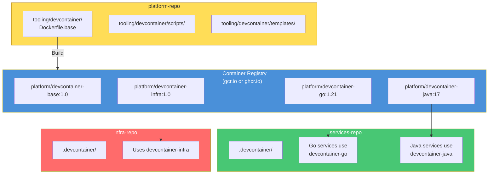
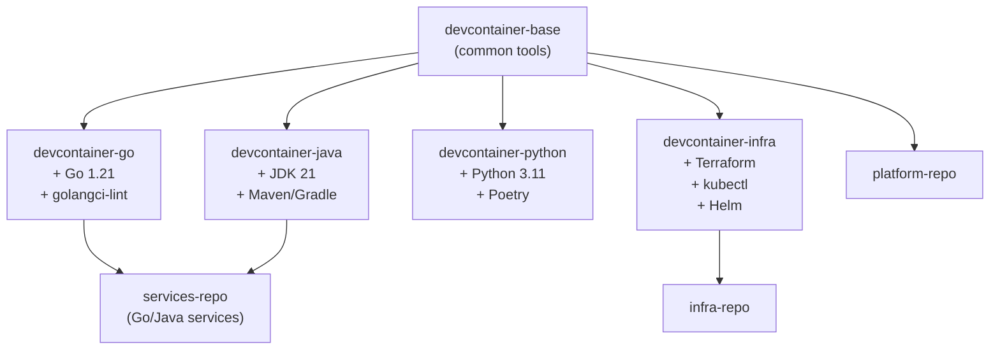

# DevContainer Strategy for Multi-Repo Architecture

**Version**: 1.0  
**Date**: 2026-04-26  
**Status**: APPROVED  
**Related**: [Migration Plan](../operations/monorepo-migration-plan.md)

---

## Overview

This document defines the DevContainer strategy for the 3-monorepo architecture:
- `services-repo` - Application development
- `platform-repo` - CI/CD, security, tooling (source of truth for devcontainer)
- `infra-repo` - Infrastructure as Code

---

## Architecture



---

## Phase 1: Initial Setup (During Migration)

During migration, each repo gets a complete `.devcontainer/` adapted to its needs.

### services-repo DevContainer

```
services-repo/
└── .devcontainer/
    ├── devcontainer.json      # Multi-stack config
    ├── docker-compose.yml     # Service definition
    ├── .env.template          # Template (secrets NOT committed)
    ├── Dockerfile             # Full stack (Go, Java, Python)
    └── scripts/
        ├── post-create.sh
        └── post-start.sh
```

**devcontainer.json for services-repo:**

```json
{
  "name": "services-dev",
  "dockerComposeFile": ["docker-compose.yml"],
  "service": "services-dev",
  "workspaceFolder": "/workspace",
  "customizations": {
    "vscode": {
      "extensions": [
        "anthropic.claude-code",
        "golang.go",
        "vscjava.vscode-java-pack",
        "ms-python.python",
        "redhat.vscode-yaml",
        "humao.rest-client",
        "ms-vscode-remote.remote-containers",
        "mermaidchart.vscode-mermaid-chart"
      ],
      "settings": {
        "terminal.integrated.defaultProfile.linux": "bash"
      },
      "mcp": {
        "servers": {
          "harness": {
            "command": "npx",
            "args": ["-y", "harness-mcp-v2"],
            "env": {
              "HARNESS_API_KEY": "${containerEnv:HARNESS_API_KEY}",
              "HARNESS_DEFAULT_ORG_ID": "${containerEnv:HARNESS_DEFAULT_ORG_ID}",
              "HARNESS_DEFAULT_PROJECT_ID": "${containerEnv:HARNESS_DEFAULT_PROJECT_ID}",
              "HARNESS_BASE_URL": "${containerEnv:HARNESS_BASE_URL}"
            }
          },
          "github": {
            "command": "npx",
            "args": ["-y", "@modelcontextprotocol/server-github"],
            "env": {
              "GITHUB_PERSONAL_ACCESS_TOKEN": "${containerEnv:GITHUB_PERSONAL_ACCESS_TOKEN}"
            }
          },
          "perplexity": {
            "command": "npx",
            "args": ["-y", "@perplexity-ai/mcp-server"],
            "env": {
              "PERPLEXITY_API_KEY": "${containerEnv:PERPLEXITY_API_KEY}"
            }
          }
        }
      }
    }
  },
  "remoteEnv": {
    "HARNESS_API_KEY": "${containerEnv:HARNESS_API_KEY}",
    "HARNESS_DEFAULT_ORG_ID": "${containerEnv:HARNESS_DEFAULT_ORG_ID}",
    "HARNESS_DEFAULT_PROJECT_ID": "${containerEnv:HARNESS_DEFAULT_PROJECT_ID}",
    "HARNESS_BASE_URL": "${containerEnv:HARNESS_BASE_URL}",
    "GITHUB_PERSONAL_ACCESS_TOKEN": "${containerEnv:GITHUB_PERSONAL_ACCESS_TOKEN}",
    "GH_TOKEN": "${containerEnv:GH_TOKEN}",
    "PERPLEXITY_API_KEY": "${containerEnv:PERPLEXITY_API_KEY}"
  },
  "remoteUser": "devuser",
  "postCreateCommand": "sh .devcontainer/scripts/post-create.sh",
  "postStartCommand": "sh .devcontainer/scripts/post-start.sh"
}
```

---

### platform-repo DevContainer

```
platform-repo/
└── .devcontainer/
    ├── devcontainer.json      # Platform tools focused
    ├── docker-compose.yml
    ├── .env.template
    ├── Dockerfile
    └── scripts/
        ├── post-create.sh
        └── post-start.sh
```

**devcontainer.json for platform-repo:**

```json
{
  "name": "platform-dev",
  "dockerComposeFile": ["docker-compose.yml"],
  "service": "platform-dev",
  "workspaceFolder": "/workspace",
  "customizations": {
    "vscode": {
      "extensions": [
        "anthropic.claude-code",
        "redhat.vscode-yaml",
        "ms-azuretools.vscode-docker",
        "hashicorp.terraform",
        "humao.rest-client",
        "ms-vscode-remote.remote-containers",
        "mermaidchart.vscode-mermaid-chart",
        "timonwong.shellcheck"
      ],
      "settings": {
        "terminal.integrated.defaultProfile.linux": "bash",
        "yaml.schemas": {
          "https://json.schemastore.org/github-workflow.json": ".harness/**/*.yaml"
        }
      },
      "mcp": {
        "servers": {
          "harness": {
            "command": "npx",
            "args": ["-y", "harness-mcp-v2"],
            "env": {
              "HARNESS_API_KEY": "${containerEnv:HARNESS_API_KEY}",
              "HARNESS_DEFAULT_ORG_ID": "${containerEnv:HARNESS_DEFAULT_ORG_ID}",
              "HARNESS_DEFAULT_PROJECT_ID": "${containerEnv:HARNESS_DEFAULT_PROJECT_ID}",
              "HARNESS_BASE_URL": "${containerEnv:HARNESS_BASE_URL}",
              "HARNESS_TOOLSETS": "pipelines,templates,policies,triggers"
            }
          },
          "github": {
            "command": "npx",
            "args": ["-y", "@modelcontextprotocol/server-github"],
            "env": {
              "GITHUB_PERSONAL_ACCESS_TOKEN": "${containerEnv:GITHUB_PERSONAL_ACCESS_TOKEN}"
            }
          }
        }
      }
    }
  },
  "remoteEnv": {
    "HARNESS_API_KEY": "${containerEnv:HARNESS_API_KEY}",
    "HARNESS_DEFAULT_ORG_ID": "${containerEnv:HARNESS_DEFAULT_ORG_ID}",
    "HARNESS_DEFAULT_PROJECT_ID": "${containerEnv:HARNESS_DEFAULT_PROJECT_ID}",
    "HARNESS_BASE_URL": "${containerEnv:HARNESS_BASE_URL}",
    "HARNESS_TOOLSETS": "${containerEnv:HARNESS_TOOLSETS}",
    "GITHUB_PERSONAL_ACCESS_TOKEN": "${containerEnv:GITHUB_PERSONAL_ACCESS_TOKEN}",
    "GH_TOKEN": "${containerEnv:GH_TOKEN}"
  },
  "remoteUser": "devuser",
  "postCreateCommand": "sh .devcontainer/scripts/post-create.sh",
  "postStartCommand": "sh .devcontainer/scripts/post-start.sh"
}
```

---

### infra-repo DevContainer

```
infra-repo/
└── .devcontainer/
    ├── devcontainer.json      # IaC tools focused
    ├── docker-compose.yml
    ├── .env.template
    ├── Dockerfile
    └── scripts/
        ├── post-create.sh
        └── post-start.sh
```

**devcontainer.json for infra-repo:**

```json
{
  "name": "infra-dev",
  "dockerComposeFile": ["docker-compose.yml"],
  "service": "infra-dev",
  "workspaceFolder": "/workspace",
  "customizations": {
    "vscode": {
      "extensions": [
        "anthropic.claude-code",
        "hashicorp.terraform",
        "ms-kubernetes-tools.vscode-kubernetes-tools",
        "redhat.vscode-yaml",
        "tim-koehler.helm-intellisense",
        "ms-azuretools.vscode-docker",
        "mermaidchart.vscode-mermaid-chart"
      ],
      "settings": {
        "terminal.integrated.defaultProfile.linux": "bash",
        "terraform.languageServer.enable": true
      },
      "mcp": {
        "servers": {
          "harness": {
            "command": "npx",
            "args": ["-y", "harness-mcp-v2"],
            "env": {
              "HARNESS_API_KEY": "${containerEnv:HARNESS_API_KEY}",
              "HARNESS_DEFAULT_ORG_ID": "${containerEnv:HARNESS_DEFAULT_ORG_ID}",
              "HARNESS_DEFAULT_PROJECT_ID": "${containerEnv:HARNESS_DEFAULT_PROJECT_ID}",
              "HARNESS_BASE_URL": "${containerEnv:HARNESS_BASE_URL}"
            }
          },
          "kubernetes": {
            "command": "npx",
            "args": ["-y", "mcp-server-kubernetes"],
            "env": {
              "KUBECONFIG": "${containerEnv:KUBECONFIG}"
            }
          },
          "github": {
            "command": "npx",
            "args": ["-y", "@modelcontextprotocol/server-github"],
            "env": {
              "GITHUB_PERSONAL_ACCESS_TOKEN": "${containerEnv:GITHUB_PERSONAL_ACCESS_TOKEN}"
            }
          }
        }
      }
    }
  },
  "remoteEnv": {
    "HARNESS_API_KEY": "${containerEnv:HARNESS_API_KEY}",
    "HARNESS_DEFAULT_ORG_ID": "${containerEnv:HARNESS_DEFAULT_ORG_ID}",
    "HARNESS_DEFAULT_PROJECT_ID": "${containerEnv:HARNESS_DEFAULT_PROJECT_ID}",
    "HARNESS_BASE_URL": "${containerEnv:HARNESS_BASE_URL}",
    "GITHUB_PERSONAL_ACCESS_TOKEN": "${containerEnv:GITHUB_PERSONAL_ACCESS_TOKEN}",
    "GH_TOKEN": "${containerEnv:GH_TOKEN}",
    "KUBECONFIG": "${containerEnv:KUBECONFIG}",
    "GOOGLE_CLOUD_PROJECT": "${containerEnv:GOOGLE_CLOUD_PROJECT}",
    "GOOGLE_APPLICATION_CREDENTIALS": "${containerEnv:GOOGLE_APPLICATION_CREDENTIALS}"
  },
  "remoteUser": "devuser",
  "postCreateCommand": "sh .devcontainer/scripts/post-create.sh",
  "postStartCommand": "sh .devcontainer/scripts/post-start.sh"
}
```

---

## Phase 2: Centralized Base Images (Post-Migration)

After migration stabilizes, centralize base images in platform-repo.

### Image Hierarchy



### Base Dockerfile (platform-repo/tooling/devcontainer/Dockerfile.base)

```dockerfile
FROM alpine:3.19

# Common base tools
RUN apk upgrade --no-cache && \
    apk add --no-cache \
    git curl wget bash jq yq \
    docker-cli docker-cli-compose \
    nodejs npm \
    ca-certificates sudo

# Non-root user
RUN adduser -D -s /bin/bash devuser && \
    echo "devuser ALL=(ALL) NOPASSWD:ALL" >> /etc/sudoers

# CLI tools via npm
RUN npm install -g \
    @anthropic-ai/claude-code \
    harness-mcp-v2 \
    @modelcontextprotocol/server-github

# Workspace
RUN mkdir -p /workspace && chown -R devuser:devuser /workspace

USER devuser
WORKDIR /workspace
```

### Go Extension (platform-repo/tooling/devcontainer/Dockerfile.go)

```dockerfile
ARG BASE_VERSION=latest
FROM platform/devcontainer-base:${BASE_VERSION}

USER root

# Go installation
ARG GO_VERSION=1.21
RUN apk add --no-cache go=${GO_VERSION}

# Go tools
RUN go install golang.org/x/tools/gopls@latest && \
    go install github.com/go-delve/delve/cmd/dlv@latest && \
    go install github.com/golangci/golangci-lint/cmd/golangci-lint@latest

USER devuser
```

---

## .env.template (DO NOT COMMIT SECRETS)

Each repo should have a `.env.template` that developers copy to `.env`:

```bash
# .devcontainer/.env.template
# Copy this file to .env and fill in your values
# NEVER commit .env to git!

# Harness
HARNESS_API_KEY=
HARNESS_DEFAULT_ORG_ID=
HARNESS_DEFAULT_PROJECT_ID=
HARNESS_BASE_URL=https://app.harness.io

# GitHub
GITHUB_PERSONAL_ACCESS_TOKEN=
GH_TOKEN=

# Google Cloud (if needed)
GOOGLE_CLOUD_PROJECT=
GOOGLE_APPLICATION_CREDENTIALS=
KUBECONFIG=

# AI Tools
PERPLEXITY_API_KEY=

# Git
GIT_USER_NAME=
GIT_USER_EMAIL=
```

---

## Scripts

### post-create.sh (Common)

```bash
#!/bin/bash
set -e

echo "[post-create] Setting up development environment..."

# Git config
if [ -n "$GIT_USER_NAME" ]; then
  git config --global user.name "$GIT_USER_NAME"
fi
if [ -n "$GIT_USER_EMAIL" ]; then
  git config --global user.email "$GIT_USER_EMAIL"
fi

# GitHub CLI auth
if [ -n "$GH_TOKEN" ]; then
  echo "$GH_TOKEN" | gh auth login --with-token 2>/dev/null || true
fi

echo "[post-create] Done!"
```

### post-start.sh (Common)

```bash
#!/bin/bash
set -e

echo "[post-start] Validating environment..."

# Docker socket permissions
if [ -S /var/run/docker.sock ]; then
  sudo chmod 666 /var/run/docker.sock 2>/dev/null || true
fi

# Validate required tools
for cmd in claude gh docker; do
  if ! command -v "$cmd" &> /dev/null; then
    echo "WARN: $cmd not found"
  fi
done

# Validate environment variables
[ -n "$HARNESS_API_KEY" ] || echo "WARN: HARNESS_API_KEY not set"
[ -n "$GITHUB_PERSONAL_ACCESS_TOKEN" ] || echo "WARN: GITHUB_PERSONAL_ACCESS_TOKEN not set"

echo "[post-start] Done!"
```

---

## Migration Checklist

### For Each Repo:

- [ ] Create `.devcontainer/` directory
- [ ] Add `devcontainer.json` (repo-specific)
- [ ] Add `docker-compose.yml`
- [ ] Add `Dockerfile` (or reference base image)
- [ ] Add `.env.template` (NOT .env)
- [ ] Add `scripts/post-create.sh`
- [ ] Add `scripts/post-start.sh`
- [ ] Add `.devcontainer/.env` to `.gitignore`
- [ ] Test devcontainer opens successfully
- [ ] Verify MCP servers connect (Harness, GitHub)

---

## Security Considerations

1. **Never commit `.env` files** - Add to `.gitignore`
2. **Use `.env.template`** - Document required variables
3. **Rotate tokens** - After migration, rotate all tokens that may have been exposed
4. **Least privilege** - Each repo's devcontainer only needs relevant tokens

---

## References

- [VS Code DevContainers](https://code.visualstudio.com/docs/devcontainers/containers)
- [DevContainer Specification](https://containers.dev/implementors/spec/)
- [MCP Servers](https://modelcontextprotocol.io/)
