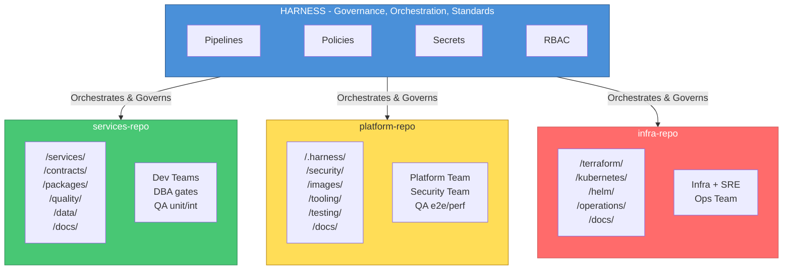
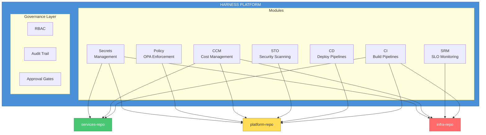

# Architecture Review Committee: Monorepo Restructuring

**Date**: 2026-04-26  
**Status**: APPROVED  
**Document Type**: Committee Review Record  

---

## Table of Contents

1. [Executive Summary](#executive-summary)
2. [Committee Composition](#committee-composition)
3. [Current State Analysis](#current-state-analysis)
4. [Proposals Evaluated](#proposals-evaluated)
5. [Stakeholder Perspectives](#stakeholder-perspectives)
6. [Final Decision](#final-decision)
7. [Implementation Requirements](#implementation-requirements)
8. [Appendices](#appendices)

---

## Executive Summary

The Architecture Review Committee convened to evaluate the restructuring of the current monorepo to improve scalability, separation of concerns, governance, and standardization.

### Key Decision

**Split into 3 domain-specific monorepos**, unified by Harness as the central SDLC orchestration platform:

| Repository | Primary Content | Ownership |
|------------|-----------------|-----------|
| `services-repo` | Application code, contracts, shared libraries, quality tests, data/migrations | Development Teams |
| `platform-repo` | CI/CD pipelines, security policies, DevContainer, E2E/performance tests, base images | Platform + Security Teams |
| `infra-repo` | Terraform, Kubernetes manifests, Helm charts, operations, observability, SRE | Infrastructure + SRE Teams |

### Unanimous Approval

All committee members voted to approve this architecture.

---

## Committee Composition

| Role | Name/Team | Primary Concern |
|------|-----------|-----------------|
| CTO | Executive | Business alignment, organizational structure |
| Staff Software Architect | Engineering | Code structure, separation of concerns |
| Staff DevOps Engineer | DevOps | CI/CD automation, pipeline efficiency |
| Staff Platform Engineer | Platform | Developer experience, tooling |
| Security Lead | Security | Vulnerabilities, compliance, policies |
| DBA Lead | Data | Schema management, migrations, performance |
| QA Lead | Quality | Testing strategy, coverage, automation |
| Operations/SRE Lead | Operations | Reliability, incidents, observability |

---

## Current State Analysis

### Repository Structure (Before)

```
/workspace
├── .harness/              # CI/CD pipelines, templates, policies, triggers
├── .devcontainer/         # Development container configuration
├── platform/
│   ├── docker/            # Dockerfiles per stack
│   ├── deploy/            # k8s, compose, harness, hashicorp
│   ├── config/            # Configurations
│   └── scripts/           # Taskfile scripts
├── services/              # 12 microservices (7 Go, 3 Java, 1 Python, 1 Node)
├── tests/                 # Integration, performance tests
├── docs/                  # Documentation
├── Taskfile.yml           # Task runner
└── go.work                # Go workspace
```

### Identified Problems

| Problem | Impact | Severity |
|---------|--------|----------|
| Mixed ownership | Unclear who approves what | High |
| Single blast radius | One bad merge affects everything | High |
| Complex CI | Pipeline must handle all scenarios | Medium |
| Compliance difficulty | Hard to isolate audit trails | Medium |
| Release coupling | All areas tied to same release cycle | Medium |
| Onboarding complexity | New developers overwhelmed | Low |

### Service Inventory

| Service | Language | Domain |
|---------|----------|--------|
| booking | Go | Reservations |
| cinema | Go | Catalog |
| movie | Go | Catalog |
| notification | Go | Communications |
| payment | Go | Payments |
| seat | Go | Catalog |
| showtime | Go | Catalog |
| user | Go | Identity |
| analytics | Java | Data |
| loyalty | Java | Growth |
| reviews | Java | Growth |
| py-app-demo | Python | Demo |

---

## Proposals Evaluated

### Proposal 1: Single Monorepo with Improved Structure

**Description**: Keep everything in one repo but reorganize directories and add strict CODEOWNERS.

| Pros | Cons |
|------|------|
| No migration needed | Doesn't solve ownership ambiguity |
| Atomic commits | Blast radius unchanged |
| Simple tooling | CI complexity remains |

**Committee Vote**: REJECTED (2 in favor, 6 against)

---

### Proposal 2: Three Monorepos (services, platform, infra)

**Description**: Split by domain into 3 repositories, with clear ownership per repo.

| Pros | Cons |
|------|------|
| Clear ownership | Cross-repo coordination needed |
| Reduced blast radius | Initial migration effort |
| Independent release cycles | Need for standards/contracts |
| Simpler CI per repo | |

**Committee Vote**: APPROVED (8 in favor, 0 against)

---

### Proposal 3: Five Monorepos (services, platform, infra, security, ops)

**Description**: Further split security and operations into dedicated repositories.

| Pros | Cons |
|------|------|
| Maximum isolation | More repos to manage |
| Perfect team alignment | Ops changes often need infra changes |
| Clear compliance boundaries | Security policies consumed by pipelines |

**Committee Vote**: REJECTED after discussion (see below)

---

### Consolidation Discussion

During committee deliberation, the following adjustments were proposed and accepted:

#### Security Team Proposal

> "Security configurations should live in platform-repo because CI/CD pipelines are the primary consumer of security policies. Co-location reduces friction."

**Conditions for acceptance**:
1. CODEOWNERS must require `@security-team` for `/security/*`
2. Branch protection on policy paths
3. Harness Policy Sets must enforce that no pipeline bypasses scans

**Decision**: ACCEPTED - Security moves to platform-repo

---

#### DBA Team Proposal

> "Migrations should stay in services-repo close to application code. Governance should be via CODEOWNERS, not physical separation."

**Conditions for acceptance**:
1. All paths matching `/services/*/db/` require `@dba-team` approval
2. Harness pipelines include migration validation gates
3. DBA team has read access to all service code for context

**Decision**: ACCEPTED - Data stays in services-repo with governance gates

---

#### QA Team Proposal

> "Unit and integration tests should live with service code. E2E and performance tests should live in platform-repo as cross-cutting concerns."

**Distribution**:
- `services-repo`: Unit tests, integration tests, contract tests, fixtures
- `platform-repo`: E2E suites, performance tests, chaos experiments

**Decision**: ACCEPTED - Distributed testing strategy

---

#### Operations/SRE Team Proposal

> "Operations configurations (dashboards, alerts, runbooks, SLOs) should live in infra-repo because they are tightly coupled to the infrastructure they monitor."

**Rationale**: When infrastructure changes, observability typically changes in the same PR.

**Decision**: ACCEPTED - Operations moves to infra-repo

---

## Stakeholder Perspectives

### CTO Perspective

> "The 3-repo structure reflects our organizational reality. We have distinct teams for services, platform, and infrastructure. Conway's Law suggests our architecture should match. Harness as the unifying layer gives us governance without bureaucracy."

**Key concerns addressed**:
- Organizational alignment ✅
- Governance centralization via Harness ✅
- Scalability for future teams ✅

---

### Staff Software Architect Perspective

> "The separation follows high cohesion principles. Components that change together should live together. Security policies are consumed by pipelines, so they belong in platform-repo. Dashboards monitor infrastructure, so they belong in infra-repo."

**Key concerns addressed**:
- Separation of concerns ✅
- Cohesion within repos ✅
- CONTRACT/SERVICE.yaml as interface ✅

---

### Staff DevOps Engineer Perspective

> "Having security policies in platform-repo means I can iterate on a pipeline and its security requirements in the same PR. This reduces the feedback loop from days to minutes."

**Key concerns addressed**:
- Pipeline-policy co-location ✅
- Faster iteration ✅
- Harness templates versionable ✅

---

### Staff Platform Engineer Perspective

> "DevContainer, generators, and tooling all live in platform-repo. A developer clones services-repo for their code, and platform-repo provides all the infrastructure to build it. Clean separation."

**Key concerns addressed**:
- Developer experience ✅
- Tooling consolidation ✅
- Onboarding simplification ✅

---

### Security Lead Perspective

> "I initially wanted a dedicated security-repo for compliance isolation. However, I accept platform-repo IF we have strict CODEOWNERS, branch protection, and Harness Policy Sets that make bypassing impossible."

**Conditions (all accepted)**:
1. `/security/*` requires `@security-team` approval ✅
2. Branch protection on `/security/policies/` ✅
3. Harness Policy Sets enforce scan requirements ✅
4. Compliance evidence auto-generated to separate location ✅

**Final position**: APPROVED with conditions

---

### DBA Lead Perspective

> "Migrations are intimately tied to application code. A schema change and its application update should be in the same PR. Physical separation creates unnecessary friction. Governance via CODEOWNERS is sufficient."

**Key concerns addressed**:
- Migration co-location with code ✅
- CODEOWNERS enforcement ✅
- Harness gates for migration validation ✅

---

### QA Lead Perspective

> "Test ownership should follow code ownership for unit/integration tests. But E2E tests span multiple services and are maintained by the QA team, so platform-repo is appropriate. This also aligns with who runs these tests (platform pipelines)."

**Key concerns addressed**:
- Test ownership clarity ✅
- E2E in platform-repo ✅
- Performance tests with QA + SRE oversight ✅

---

### Operations/SRE Lead Perspective

> "Runbooks and dashboards change frequently, often in response to infrastructure changes. Having them in infra-repo means one PR for the change and its observability. Separate repos would mean 2 PRs that need to be coordinated."

**Key concerns addressed**:
- Ops-infra co-location ✅
- Reduced coordination overhead ✅
- Harness SRM integration ✅

---

## Final Decision

### Approved Architecture



> **ASCII Backup**: See [diagrams-ascii-backup.md](./diagrams-ascii-backup.md#arch-001-final-approved-architecture-3-monorepos--harness)

### Voting Record

| Committee Member | Vote | Conditions |
|------------------|------|------------|
| CTO | ✅ APPROVE | None |
| Staff Software Architect | ✅ APPROVE | SERVICE.yaml contract required |
| Staff DevOps Engineer | ✅ APPROVE | None |
| Staff Platform Engineer | ✅ APPROVE | None |
| Security Lead | ✅ APPROVE | CODEOWNERS + Policy Sets |
| DBA Lead | ✅ APPROVE | Mandatory review gates |
| QA Lead | ✅ APPROVE | Clear test ownership |
| Operations/SRE Lead | ✅ APPROVE | None |

**Result**: UNANIMOUS APPROVAL (8-0)

---

## Implementation Requirements

### Critical Success Factors

1. **SERVICE.yaml as Universal Contract**
   - Every service must have a SERVICE.yaml file
   - Platform-repo pipelines consume this metadata
   - Schema must be versioned and documented

2. **CODEOWNERS Enforcement**
   - All repos must have CODEOWNERS files
   - Branch protection must require CODEOWNERS approval
   - Critical paths must have multiple required reviewers

3. **Harness Policy Sets**
   - No pipeline can bypass security scans
   - Production deployments require approval gates
   - All changes must pass governance checks

4. **Semantic Versioning**
   - Platform-repo templates must be versioned
   - Security policies must be versioned
   - Breaking changes require major version bump

5. **Documentation Hub**
   - Central location linking all repo docs
   - Onboarding guide spanning all repos
   - Runbook index accessible from Harness

### Migration Timeline

See [Migration Plan](../operations/monorepo-migration-plan.md) for detailed phases.

| Phase | Duration | Scope |
|-------|----------|-------|
| Phase 1 | 2 weeks | Foundation & preparation |
| Phase 2 | 2 weeks | services-repo extraction |
| Phase 3 | 2 weeks | platform-repo extraction |
| Phase 4 | 2 weeks | infra-repo extraction |
| Phase 5 | 1 week | Validation & cutover |
| Phase 6 | 1 week | Cleanup & documentation |

**Total**: 10 weeks

---

## Appendices

### Appendix A: Rejected Alternatives

#### Alternative 1: Polyrepo (1 repo per service)

**Rejection reason**: Diamond dependency problem, loss of atomic refactoring, excessive overhead for current team size.

#### Alternative 2: Keep single monorepo

**Rejection reason**: Does not solve ownership, blast radius, or compliance concerns.

#### Alternative 3: Five repos (separate security and ops)

**Rejection reason**: Over-engineering for current needs. Security policies are consumed by pipelines (belong together). Ops is tightly coupled to infra (belong together).

---

### Appendix B: SERVICE.yaml Specification

```yaml
apiVersion: platform/v1
kind: ServiceManifest
metadata:
  name: booking              # Service identifier
  version: "1.2.0"           # Service version
  team: reservations-squad   # Owning team
  tier: critical             # critical | standard | experimental
  
spec:
  language: go
  runtime: "1.21"
  
  build:
    baseImage: "platform/base-go:1.21"
    dockerfile: "./Dockerfile"
    
  deploy:
    namespace: reservations
    replicas:
      dev: 1
      staging: 2
      prod: 3
    resources:
      cpu: "100m-500m"
      memory: "128Mi-512Mi"
      
  dependencies:
    services:
      - payment
      - notification
    infrastructure:
      - mongodb
      - redis
      
  ports:
    http: 8080
    grpc: 9090
    metrics: 9091
    
  healthcheck:
    path: /health
    interval: 30s
    
  slos:
    availability: 99.9
    latency_p99_ms: 200
    
  contacts:
    oncall: "@reservations-oncall"
    slack: "#team-reservations"
```

---

### Appendix C: CODEOWNERS Templates

#### services-repo CODEOWNERS

```gitignore
# Default
*                               @tech-leads

# Service ownership
/services/booking/              @reservations-squad
/services/payment/              @payments-squad
/services/user/                 @identity-squad
/services/notification/         @comms-squad
/services/movie/                @catalog-squad
/services/cinema/               @catalog-squad
/services/showtime/             @catalog-squad
/services/seat/                 @catalog-squad
/services/analytics/            @data-squad
/services/loyalty/              @growth-squad
/services/reviews/              @growth-squad

# Cross-cutting governance
/services/*/db/                 @dba-team
/contracts/                     @api-governance @security-team
/packages/                      @platform-team @tech-leads
/quality/                       @qa-team
```

#### platform-repo CODEOWNERS

```gitignore
# Default
*                               @platform-team

# Security (mandatory review)
/security/                      @security-team
/security/policies/             @security-team @compliance-officer
/security/compliance/           @security-team @compliance-officer

# Pipelines (shared ownership)
/.harness/pipelines/            @platform-team @security-team

# Testing
/testing/e2e/                   @qa-team
/testing/performance/           @qa-team @sre-team

# Images (security review for base images)
/images/                        @platform-team @security-team
```

#### infra-repo CODEOWNERS

```gitignore
# Default
*                               @infra-team

# Production (elevated approval)
/terraform/environments/prod/   @infra-team @security-team @sre-leads
/kubernetes/overlays/prod/      @infra-team @sre-leads

# Operations
/operations/                    @sre-team
/operations/runbooks/services/  @sre-team @service-owners
/operations/chaos/              @sre-team @security-team
/operations/cost/               @sre-team @finance-team

# Security-sensitive paths
/kubernetes/base/network-*/     @infra-team @security-team
/terraform/modules/iam/         @infra-team @security-team
```

---

### Appendix D: Harness Integration Points



| Harness Module | Integration | Repository |
|----------------|-------------|------------|
| CI | Build pipelines | All repos |
| CD | Deployment pipelines | platform-repo |
| STO | Security scanning | platform-repo policies |
| SRM | SLO monitoring | infra-repo SLOs |
| CCM | Cost management | All repos |
| Policy | OPA enforcement | platform-repo policies |
| Secrets | Secret management | All repos |
| Audit | Compliance logging | All repos |

---

### Appendix E: Risk Register

| Risk | Probability | Impact | Mitigation |
|------|-------------|--------|------------|
| Cross-repo breaking changes | Medium | High | Semantic versioning, contract tests |
| Migration data loss | Low | Critical | Backup before migration, phased approach |
| Team confusion during transition | High | Medium | Clear documentation, training sessions |
| CI/CD downtime | Medium | High | Parallel pipelines, feature flags |
| Governance gaps | Medium | High | Harness Policy Sets, CODEOWNERS |

---

## Document History

| Version | Date | Author | Changes |
|---------|------|--------|---------|
| 1.0 | 2026-04-26 | Architecture Committee | Initial document |

---

## Signatures

- [ ] CTO
- [ ] Staff Software Architect
- [ ] Staff DevOps Engineer
- [ ] Staff Platform Engineer
- [ ] Security Lead
- [ ] DBA Lead
- [ ] QA Lead
- [ ] Operations/SRE Lead
