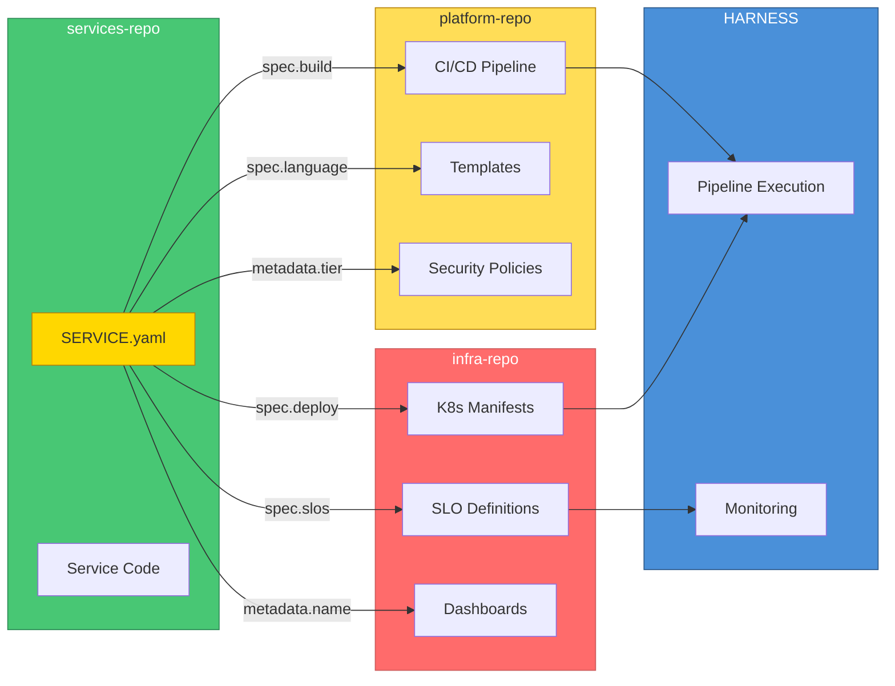
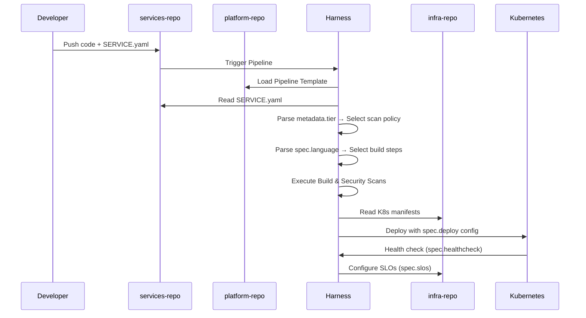

# SERVICE.yaml Specification

**Version**: 1.0  
**Date**: 2026-04-26  
**Status**: APPROVED  
**Related ADR**: [ADR-007](./adr/ADR-007-monorepo-restructuring-strategy.md)

---

## Overview

`SERVICE.yaml` is a mandatory manifest file that every service in `services-repo` must have. It serves as a **contract** between the service and the platform, enabling:

- Automated pipeline configuration
- Deployment orchestration
- Observability setup
- Dependency tracking
- Team ownership mapping

### How SERVICE.yaml Flows Through the System





---

## File Location

```
services-repo/
└── services/
    └── {service-name}/
        └── SERVICE.yaml    # Required at service root
```

---

## Schema Definition

### Full Schema (v1)

```yaml
# SERVICE.yaml - Version 1.0

apiVersion: platform/v1          # Required: API version
kind: ServiceManifest            # Required: Resource type

metadata:                        # Required: Service metadata
  name: string                   # Required: Unique service identifier
  version: string                # Required: Semantic version (e.g., "1.2.0")
  team: string                   # Required: Owning team identifier
  tier: enum                     # Required: critical | standard | experimental
  description: string            # Optional: Brief description
  tags: [string]                 # Optional: Searchable tags

spec:                            # Required: Service specification
  language: enum                 # Required: go | java | python | node
  runtime: string                # Required: Runtime version (e.g., "1.21")
  framework: string              # Optional: Framework used (e.g., "gin", "spring")
  
  build:                         # Required: Build configuration
    baseImage: string            # Required: Reference to platform-repo base image
    dockerfile: string           # Optional: Path to Dockerfile (default: "./Dockerfile")
    context: string              # Optional: Build context (default: ".")
    args: map[string]string      # Optional: Build arguments
    
  deploy:                        # Required: Deployment configuration
    namespace: string            # Required: Kubernetes namespace
    strategy: enum               # Optional: rolling | canary | blue-green (default: rolling)
    replicas:                    # Required: Replica counts per environment
      dev: integer               # Required: Development replicas
      staging: integer           # Required: Staging replicas
      prod: integer              # Required: Production replicas
    resources:                   # Required: Resource limits
      cpu: string                # Required: CPU range (e.g., "100m-500m")
      memory: string             # Required: Memory range (e.g., "128Mi-512Mi")
    autoscaling:                 # Optional: HPA configuration
      enabled: boolean
      minReplicas: integer
      maxReplicas: integer
      targetCPU: integer         # Percentage
      
  dependencies:                  # Optional: Service dependencies
    services: [string]           # Optional: List of dependent service names
    infrastructure: [string]     # Optional: List of infra dependencies (mongodb, redis, etc.)
    external: [string]           # Optional: External service dependencies
    
  ports:                         # Required: Exposed ports
    http: integer                # Required: HTTP port (typically 8080)
    grpc: integer                # Optional: gRPC port
    metrics: integer             # Optional: Prometheus metrics port
    debug: integer               # Optional: Debug/profiling port
    
  healthcheck:                   # Required: Health check configuration
    path: string                 # Required: Health endpoint path
    port: integer                # Optional: Port for health check (default: http port)
    interval: string             # Optional: Check interval (default: "30s")
    timeout: string              # Optional: Timeout (default: "5s")
    initialDelay: string         # Optional: Initial delay (default: "10s")
    
  slos:                          # Optional: Service Level Objectives
    availability: number         # Target availability (e.g., 99.9)
    latency_p50_ms: integer      # P50 latency target
    latency_p99_ms: integer      # P99 latency target
    error_rate: number           # Max error rate percentage
    
  security:                      # Optional: Security configuration
    scanPolicy: enum             # standard | strict | critical (default based on tier)
    requireMTLS: boolean         # Require mutual TLS
    allowedNamespaces: [string]  # Namespaces allowed to call this service
    
  contacts:                      # Required: Contact information
    oncall: string               # Required: On-call rotation reference
    slack: string                # Required: Slack channel
    email: string                # Optional: Team email
    escalation: string           # Optional: Escalation path
    
  documentation:                 # Optional: Documentation links
    readme: string               # Path to README
    api: string                  # Path to API docs
    runbook: string              # Path to runbook in infra-repo
```

---

## Examples

### Go Service (Critical Tier)

```yaml
apiVersion: platform/v1
kind: ServiceManifest
metadata:
  name: booking
  version: "2.1.0"
  team: reservations-squad
  tier: critical
  description: "Handles movie ticket reservations and seat allocation"
  tags:
    - reservations
    - payments
    - core

spec:
  language: go
  runtime: "1.21"
  framework: gin
  
  build:
    baseImage: "platform/base-go:1.21"
    dockerfile: "./Dockerfile"
    args:
      CGO_ENABLED: "0"
      
  deploy:
    namespace: reservations
    strategy: canary
    replicas:
      dev: 1
      staging: 2
      prod: 5
    resources:
      cpu: "200m-1000m"
      memory: "256Mi-1Gi"
    autoscaling:
      enabled: true
      minReplicas: 3
      maxReplicas: 10
      targetCPU: 70
      
  dependencies:
    services:
      - payment
      - notification
      - user
      - showtime
    infrastructure:
      - mongodb
      - redis
      - kafka
      
  ports:
    http: 8080
    grpc: 9090
    metrics: 9091
    debug: 6060
    
  healthcheck:
    path: /health
    interval: 15s
    timeout: 3s
    initialDelay: 10s
    
  slos:
    availability: 99.95
    latency_p50_ms: 50
    latency_p99_ms: 200
    error_rate: 0.1
    
  security:
    scanPolicy: critical
    requireMTLS: true
    allowedNamespaces:
      - api-gateway
      - reservations
      
  contacts:
    oncall: "@reservations-oncall"
    slack: "#team-reservations"
    email: "reservations@company.com"
    escalation: "@sre-leads → @vp-engineering"
    
  documentation:
    readme: "./README.md"
    api: "./api/openapi.yaml"
    runbook: "operations/runbooks/services/booking/"
```

### Java Service (Standard Tier)

```yaml
apiVersion: platform/v1
kind: ServiceManifest
metadata:
  name: analytics
  version: "1.5.0"
  team: data-squad
  tier: standard
  description: "Analytics and reporting service"
  tags:
    - analytics
    - reporting
    - batch

spec:
  language: java
  runtime: "17"
  framework: spring-boot
  
  build:
    baseImage: "platform/base-java:17"
    dockerfile: "./Dockerfile"
    args:
      GRADLE_OPTS: "-Xmx512m"
      
  deploy:
    namespace: analytics
    strategy: rolling
    replicas:
      dev: 1
      staging: 1
      prod: 2
    resources:
      cpu: "500m-2000m"
      memory: "512Mi-2Gi"
      
  dependencies:
    services:
      - booking
      - user
    infrastructure:
      - postgresql
      - elasticsearch
      
  ports:
    http: 8080
    metrics: 8081
    
  healthcheck:
    path: /actuator/health
    interval: 30s
    
  slos:
    availability: 99.5
    latency_p99_ms: 1000
    
  contacts:
    oncall: "@data-oncall"
    slack: "#team-data"
```

### Python Service (Experimental Tier)

```yaml
apiVersion: platform/v1
kind: ServiceManifest
metadata:
  name: py-app-demo
  version: "0.1.0"
  team: platform-team
  tier: experimental
  description: "Python demo application for testing"
  tags:
    - demo
    - python
    - experimental

spec:
  language: python
  runtime: "3.11"
  framework: fastapi
  
  build:
    baseImage: "platform/base-python:3.11"
    
  deploy:
    namespace: demos
    replicas:
      dev: 1
      staging: 0
      prod: 0
    resources:
      cpu: "50m-200m"
      memory: "64Mi-256Mi"
      
  ports:
    http: 8000
    
  healthcheck:
    path: /health
    
  contacts:
    oncall: "@platform-oncall"
    slack: "#platform-support"
```

---

## Validation Rules

### Required Fields Validation

| Field | Rule | Error Message |
|-------|------|---------------|
| `metadata.name` | Must match directory name | "Service name must match directory" |
| `metadata.version` | Semantic versioning | "Version must be semver format" |
| `metadata.team` | Must exist in teams registry | "Unknown team identifier" |
| `metadata.tier` | Must be valid enum | "Tier must be critical, standard, or experimental" |
| `spec.language` | Must be supported | "Unsupported language" |
| `spec.deploy.replicas.prod` | > 0 for critical tier | "Critical services must have prod replicas" |

### Cross-Field Validation

```yaml
rules:
  - name: critical-tier-requirements
    condition: metadata.tier == "critical"
    require:
      - spec.slos.availability >= 99.9
      - spec.deploy.replicas.prod >= 3
      - spec.security.scanPolicy == "critical"
      - spec.deploy.autoscaling.enabled == true
      
  - name: experimental-tier-restrictions
    condition: metadata.tier == "experimental"
    require:
      - spec.deploy.replicas.prod == 0
      - spec.deploy.replicas.staging <= 1
```

---

## Pipeline Integration

### How Pipelines Consume SERVICE.yaml

```yaml
# platform-repo/.harness/pipelines/ci/service-ci.yaml

steps:
  - step:
      name: Read Service Manifest
      type: Run
      spec:
        command: |
          SERVICE_PATH="services/${SERVICE_NAME}"
          
          # Parse manifest
          export SVC_LANGUAGE=$(yq '.spec.language' "$SERVICE_PATH/SERVICE.yaml")
          export SVC_RUNTIME=$(yq '.spec.runtime' "$SERVICE_PATH/SERVICE.yaml")
          export SVC_TIER=$(yq '.metadata.tier' "$SERVICE_PATH/SERVICE.yaml")
          export SVC_BASE_IMAGE=$(yq '.spec.build.baseImage' "$SERVICE_PATH/SERVICE.yaml")
          
          # Determine scan policy based on tier
          case $SVC_TIER in
            critical) export SCAN_POLICY="critical" ;;
            standard) export SCAN_POLICY="standard" ;;
            *) export SCAN_POLICY="basic" ;;
          esac
          
  - step:
      name: Build
      type: BuildAndPush
      spec:
        dockerfile: <+execution.steps.Read_Service_Manifest.output.outputVariables.DOCKERFILE>
        context: services/${SERVICE_NAME}
        tags:
          - <+pipeline.variables.SERVICE_NAME>:<+codebase.commitSha>
          
  - step:
      name: Security Scan
      type: Security
      spec:
        policy_set: <+execution.steps.Read_Service_Manifest.output.outputVariables.SCAN_POLICY>
```

---

## Governance

### CODEOWNERS for SERVICE.yaml

```gitignore
# Each service team owns their SERVICE.yaml
/services/booking/SERVICE.yaml    @reservations-squad @platform-team
/services/payment/SERVICE.yaml    @payments-squad @platform-team

# Platform team must approve tier changes
# (enforced via PR automation)
```

### Automated Validation

```yaml
# .github/workflows/validate-service-yaml.yaml (if using GitHub)
# Or equivalent Harness trigger

name: Validate SERVICE.yaml
on:
  pull_request:
    paths:
      - 'services/**/SERVICE.yaml'

jobs:
  validate:
    runs-on: ubuntu-latest
    steps:
      - uses: actions/checkout@v4
      
      - name: Validate Schema
        run: |
          for manifest in $(find services -name SERVICE.yaml); do
            echo "Validating $manifest"
            yq eval '.' "$manifest" > /dev/null
            # Add JSON Schema validation here
          done
          
      - name: Check Required Fields
        run: |
          ./scripts/validate-service-manifest.sh
```

---

## Migration Guide

### Adding SERVICE.yaml to Existing Service

1. Copy the template for your language
2. Fill in metadata (name, team, tier)
3. Update spec based on current configuration
4. Validate locally: `yq eval '.' SERVICE.yaml`
5. Create PR with SERVICE.yaml
6. Get approval from your team + platform team

### Template Generator

```bash
# Using the generator in platform-repo
cd platform-repo/tooling/generators

# Generate SERVICE.yaml for a new Go service
./generate-service.sh --name my-service --language go --team my-team --tier standard
```

---

## Changelog

| Version | Date | Changes |
|---------|------|---------|
| 1.0 | 2026-04-26 | Initial specification |

---

## References

- [ADR-007: Monorepo Restructuring](./adr/ADR-007-monorepo-restructuring-strategy.md)
- [Committee Review](./monorepo-committee-review-2026-04.md)
- [Migration Plan](../operations/monorepo-migration-plan.md)
