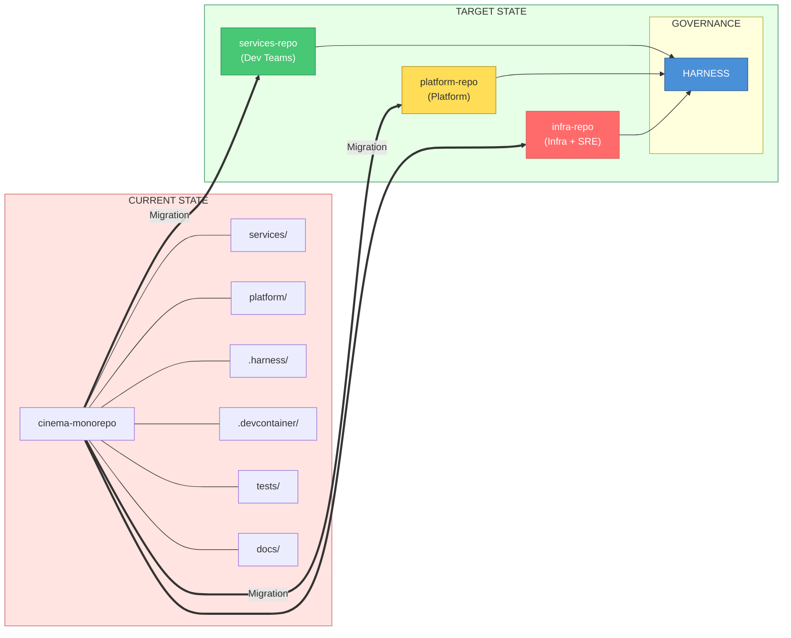
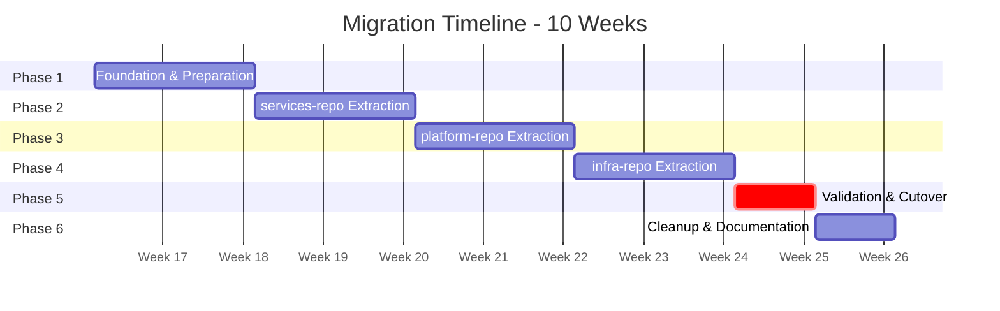
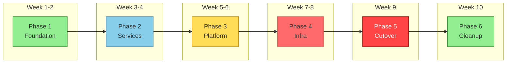

# Monorepo Migration Plan

**Version**: 1.0  
**Date**: 2026-04-26  
**Status**: APPROVED  
**Related ADR**: [ADR-007](../architecture/adr/ADR-007-monorepo-restructuring-strategy.md)  
**Committee Review**: [Committee Document](../architecture/monorepo-committee-review-2026-04.md)

---

## Table of Contents

1. [Executive Summary](#executive-summary)
2. [Migration Overview](#migration-overview)
3. [Pre-Migration Checklist](#pre-migration-checklist)
4. [Phase 1: Foundation & Preparation](#phase-1-foundation--preparation)
5. [Phase 2: services-repo Extraction](#phase-2-services-repo-extraction)
6. [Phase 3: platform-repo Extraction](#phase-3-platform-repo-extraction)
7. [Phase 4: infra-repo Extraction](#phase-4-infra-repo-extraction)
8. [Phase 5: Validation & Cutover](#phase-5-validation--cutover)
9. [Phase 6: Cleanup & Documentation](#phase-6-cleanup--documentation)
10. [Rollback Procedures](#rollback-procedures)
11. [Risk Management](#risk-management)
12. [Communication Plan](#communication-plan)
13. [Success Criteria](#success-criteria)

---

## Executive Summary

This document outlines the migration plan to split the current monorepo into 3 domain-specific repositories:

| Repository | Content | Owner |
|------------|---------|-------|
| `services-repo` | Application code, contracts, libraries, tests, data | Development Teams |
| `platform-repo` | CI/CD, security, tooling, E2E tests, base images | Platform + Security |
| `infra-repo` | Terraform, Kubernetes, Helm, operations, observability | Infra + SRE |

**Timeline**: 10 weeks  
**Risk Level**: Medium  
**Rollback Capability**: Full rollback available until Phase 5 completion

---

## Migration Overview

### Current State → Target State



### Timeline Overview





> **ASCII Backup**: See [diagrams-ascii-backup.md](../architecture/diagrams-ascii-backup.md#mig-001-current-state-to-target-state)

---

## Pre-Migration Checklist

### Technical Prerequisites

- [ ] All CI pipelines green on main branch
- [ ] No active feature branches with > 1 week of work
- [ ] Git LFS configured if needed for large files
- [ ] Backup of current repository created
- [ ] Access to create new repositories in Git provider
- [ ] Harness API access for pipeline updates
- [ ] All team leads notified and available

### Organizational Prerequisites

- [ ] Migration window approved (low-traffic period)
- [ ] On-call schedule adjusted for migration period
- [ ] Stakeholder sign-off obtained
- [ ] Communication sent to all developers
- [ ] Training materials prepared

### Tooling Prerequisites

- [ ] `git-filter-repo` installed (for history preservation)
- [ ] Repository templates created
- [ ] CODEOWNERS files drafted
- [ ] SERVICE.yaml template finalized
- [ ] Harness connectors configured for new repos

---

## Phase 1: Foundation & Preparation

**Duration**: 2 weeks  
**Risk Level**: Low  
**Rollback**: Not needed (no production changes)

### Week 1: Standards & Templates

#### Day 1-2: Create Repository Templates

```bash
# Create template repositories with standard structure

# services-repo template
mkdir -p templates/services-repo/{services,contracts,packages,quality,data,docs}
touch templates/services-repo/{CODEOWNERS,README.md,Taskfile.yml,go.work,.gitignore}

# platform-repo template  
mkdir -p templates/platform-repo/{.harness,security,images,tooling,testing,docs}
touch templates/platform-repo/{CODEOWNERS,README.md,CHANGELOG.md,.gitignore}

# infra-repo template
mkdir -p templates/infra-repo/{terraform,kubernetes,helm,operations,docs}
touch templates/infra-repo/{CODEOWNERS,README.md,CHANGELOG.md,.gitignore}
```

#### Day 3-4: Finalize SERVICE.yaml Schema

Create and validate the SERVICE.yaml schema that will be required for all services:

```yaml
# services-repo/services/{service}/SERVICE.yaml
apiVersion: platform/v1
kind: ServiceManifest
metadata:
  name: string           # Required: service identifier
  version: string        # Required: semantic version
  team: string           # Required: owning team
  tier: enum             # Required: critical | standard | experimental

spec:
  language: enum         # Required: go | java | python | node
  runtime: string        # Required: runtime version
  
  build:
    baseImage: string    # Required: reference to platform-repo image
    dockerfile: string   # Optional: path to Dockerfile
    context: string      # Optional: build context
    
  deploy:
    namespace: string    # Required: k8s namespace
    replicas:            # Required: replica counts per environment
      dev: integer
      staging: integer
      prod: integer
    resources:           # Required: resource limits
      cpu: string
      memory: string
      
  dependencies:
    services: [string]   # Optional: dependent services
    infrastructure: [string]  # Optional: infra dependencies
    
  ports:                 # Required: exposed ports
    http: integer
    grpc: integer        # Optional
    metrics: integer     # Optional
    
  healthcheck:           # Required: health check config
    path: string
    interval: string
    
  slos:                  # Optional: SLO targets
    availability: number
    latency_p99_ms: integer
    
  contacts:              # Required: contact information
    oncall: string
    slack: string
```

#### Day 5: Create CODEOWNERS Files

**services-repo CODEOWNERS:**
```gitignore
# Default owner
*                               @tech-leads

# Service ownership (to be filled per service)
/services/booking/              @reservations-squad
/services/payment/              @payments-squad
/services/user/                 @identity-squad
/services/notification/         @comms-squad
/services/movie/                @catalog-squad
/services/cinema/               @catalog-squad
/services/showtime/             @catalog-squad
/services/seat/                 @catalog-squad
/services/analytics/            @data-squad
/services/loyalty/              @growth-squad
/services/reviews/              @growth-squad
/services/py-app-demo/          @platform-team

# Cross-cutting governance
/services/*/db/                 @dba-team
/services/*/db/migrations/      @dba-team
/contracts/                     @api-governance @security-team
/packages/                      @platform-team @tech-leads
/quality/                       @qa-team
/data/                          @dba-team
```

**platform-repo CODEOWNERS:**
```gitignore
# Default owner
*                               @platform-team

# Security Team mandatory reviews
/security/                      @security-team
/security/policies/             @security-team @compliance-officer
/security/compliance/           @security-team @compliance-officer
/security/scanning/             @security-team

# Pipeline governance
/.harness/                      @platform-team @devops-leads
/.harness/pipelines/            @platform-team @security-team

# Testing
/testing/e2e/                   @qa-team @platform-team
/testing/performance/           @qa-team @sre-team

# Base images require security review
/images/                        @platform-team @security-team

# Tooling
/tooling/                       @platform-team
/tooling/devcontainer/          @platform-team
/tooling/generators/            @platform-team
```

**infra-repo CODEOWNERS:**
```gitignore
# Default owner
*                               @infra-team

# Production environments require elevated approval
/terraform/environments/prod/   @infra-team @security-team @sre-leads
/kubernetes/overlays/prod/      @infra-team @sre-leads

# Terraform modules
/terraform/modules/             @infra-team
/terraform/modules/iam/         @infra-team @security-team
/terraform/modules/secrets/     @infra-team @security-team

# Operations (SRE ownership)
/operations/                    @sre-team
/operations/observability/      @sre-team
/operations/runbooks/           @sre-team
/operations/runbooks/services/  @sre-team @service-owners
/operations/playbooks/          @sre-team
/operations/chaos/              @sre-team @security-team
/operations/cost/               @sre-team @finance-team
/operations/oncall/             @sre-team

# Kubernetes
/kubernetes/                    @infra-team
/kubernetes/base/network-*/     @infra-team @security-team

# Helm
/helm/                          @infra-team
```

#### Day 5-6: Prepare DevContainer Configurations

Each repo must have a working `.devcontainer/` from day one. See [DevContainer Strategy](../architecture/devcontainer-strategy.md).

```bash
# Create devcontainer structure for each repo template

for repo in services-repo platform-repo infra-repo; do
  mkdir -p "templates/$repo/.devcontainer/scripts"
  touch "templates/$repo/.devcontainer/devcontainer.json"
  touch "templates/$repo/.devcontainer/docker-compose.yml"
  touch "templates/$repo/.devcontainer/Dockerfile"
  touch "templates/$repo/.devcontainer/.env.template"
  touch "templates/$repo/.devcontainer/scripts/post-create.sh"
  touch "templates/$repo/.devcontainer/scripts/post-start.sh"
  
  # Add .env to gitignore
  echo ".devcontainer/.env" >> "templates/$repo/.gitignore"
done
```

**Key differences per repo:**

| Repo | Extensions Focus | MCP Servers | Tools |
|------|------------------|-------------|-------|
| services-repo | Go, Java, Python | harness, github, perplexity | Go, JDK, Python |
| platform-repo | YAML, Docker, Shell | harness, github | Docker, Make |
| infra-repo | Terraform, K8s, Helm | harness, github, kubernetes | Terraform, kubectl, Helm |

### Week 2: Infrastructure Setup

#### Day 7-8: Create Empty Repositories

```bash
# Using GitHub CLI (or equivalent for your Git provider)

# Create services-repo
gh repo create org/services-repo \
  --private \
  --description "Application microservices, contracts, and shared libraries"

# Create platform-repo
gh repo create org/platform-repo \
  --private \
  --description "CI/CD pipelines, security policies, and developer tooling"

# Create infra-repo
gh repo create org/infra-repo \
  --private \
  --description "Infrastructure as Code, Kubernetes, and operations"
```

#### Day 8-9: Configure Branch Protection

For each repository, configure:

```yaml
# Branch protection rules for 'main' branch

# All repos
required_pull_request_reviews:
  required_approving_review_count: 1
  require_code_owner_reviews: true
  dismiss_stale_reviews: true
  
required_status_checks:
  strict: true
  contexts:
    - "ci/build"
    - "ci/test"
    - "security/scan"

restrictions:
  enforce_admins: true
  
allow_force_pushes: false
allow_deletions: false

# Additional for infra-repo (prod paths)
required_pull_request_reviews:
  required_approving_review_count: 2  # Elevated for infra
```

#### Day 10: Configure Harness Connectors

```yaml
# Harness Git Connector for services-repo
connector:
  name: services-repo-connector
  identifier: services_repo
  type: Github
  spec:
    url: https://github.com/org/services-repo
    authentication:
      type: Http
      spec:
        type: UsernameToken
        username: harness-bot
        tokenRef: github_pat

# Repeat for platform-repo and infra-repo
```

### Phase 1 Deliverables

| Deliverable | Status | Owner |
|-------------|--------|-------|
| Repository templates created | ⬜ | Platform Team |
| SERVICE.yaml schema finalized | ⬜ | Architect |
| CODEOWNERS files drafted | ⬜ | All Teams |
| **DevContainer configs for 3 repos** | ⬜ | Platform Team |
| Empty repositories created | ⬜ | Platform Team |
| Branch protection configured | ⬜ | Platform Team |
| Harness connectors configured | ⬜ | DevOps Team |
| Team communication sent | ⬜ | Project Lead |

### Phase 1 Go/No-Go Criteria

- [ ] All repositories created and accessible
- [ ] Branch protection rules active
- [ ] Harness can connect to all repositories
- [ ] **DevContainer opens successfully in each repo**
- [ ] **MCP servers (Harness, GitHub) connect in DevContainer**
- [ ] All team leads have confirmed readiness
- [ ] No critical incidents in progress

---

## Phase 2: services-repo Extraction

**Duration**: 2 weeks  
**Risk Level**: Medium  
**Rollback**: Restore from backup, delete new repo

### Week 3: Extraction & Initial Migration

#### Day 11-12: Extract Services with History

```bash
# Clone the original monorepo
git clone https://github.com/org/cinema-monorepo.git services-extraction
cd services-extraction

# Install git-filter-repo if not present
pip install git-filter-repo

# Filter to keep only services-related paths
git filter-repo \
  --path services/ \
  --path contracts/ \
  --path packages/ \
  --path tests/ \
  --path docs/services/ \
  --path docs/api/ \
  --path go.work \
  --path go.work.sum \
  --path Taskfile.yml \
  --path .gitignore

# Restructure directories
mkdir -p quality data

# Move tests to quality
git mv tests/integration quality/
git mv tests/performance quality/  # Will move to platform-repo later

# Create data directory structure
mkdir -p data/{seeds,schemas}

# Extract migrations from services (if embedded)
for svc in services/*/; do
  if [ -d "$svc/db/migrations" ]; then
    service_name=$(basename "$svc")
    mkdir -p "data/migrations/$service_name"
    # Migrations stay in service, but create symlink reference
  fi
done
```

#### Day 13: Create SERVICE.yaml for Each Service

```bash
# Script to generate SERVICE.yaml for each service
for svc_dir in services/*/; do
  svc=$(basename "$svc_dir")
  
  # Detect language
  if [ -f "$svc_dir/go.mod" ]; then
    lang="go"
    runtime="1.21"
  elif [ -f "$svc_dir/build.gradle" ]; then
    lang="java"
    runtime="17"
  elif [ -f "$svc_dir/requirements.txt" ]; then
    lang="python"
    runtime="3.11"
  else
    lang="unknown"
    runtime="unknown"
  fi
  
  cat > "$svc_dir/SERVICE.yaml" << EOF
apiVersion: platform/v1
kind: ServiceManifest
metadata:
  name: $svc
  version: "1.0.0"
  team: "TODO-assign-team"
  tier: standard

spec:
  language: $lang
  runtime: "$runtime"
  
  build:
    baseImage: "platform/base-$lang:$runtime"
    dockerfile: "./Dockerfile"
    
  deploy:
    namespace: default
    replicas:
      dev: 1
      staging: 2
      prod: 3
    resources:
      cpu: "100m-500m"
      memory: "128Mi-512Mi"
      
  dependencies:
    services: []
    infrastructure: []
    
  ports:
    http: 8080
    metrics: 9091
    
  healthcheck:
    path: /health
    interval: 30s
    
  contacts:
    oncall: "@TODO"
    slack: "#TODO"
EOF

  git add "$svc_dir/SERVICE.yaml"
done

git commit -m "feat: add SERVICE.yaml manifests for all services"
```

#### Day 14-15: Push and Configure

```bash
# Add new remote and push
git remote add origin https://github.com/org/services-repo.git
git push -u origin main

# Create develop branch
git checkout -b develop
git push -u origin develop
```

### Week 4: Validation & Service Team Handoff

#### Day 16-17: Validate Build & Test

```yaml
# Harness pipeline for services-repo validation
pipeline:
  name: services-repo-validation
  stages:
    - stage:
        name: Validate All Services
        type: CI
        spec:
          execution:
            steps:
              - stepGroup:
                  name: Build Services
                  steps:
                    - step:
                        type: Run
                        name: Build Go Services
                        spec:
                          shell: Bash
                          command: |
                            for svc in services/*/; do
                              if [ -f "$svc/go.mod" ]; then
                                echo "Building $(basename $svc)"
                                cd "$svc" && go build ./... && cd -
                              fi
                            done
                            
              - stepGroup:
                  name: Run Tests
                  steps:
                    - step:
                        type: Run
                        name: Unit Tests
                        spec:
                          shell: Bash
                          command: |
                            for svc in services/*/; do
                              if [ -f "$svc/go.mod" ]; then
                                cd "$svc" && go test ./... && cd -
                              fi
                            done
```

#### Day 18-19: Service Team Handoff

**Handoff checklist per service team:**

- [ ] Clone services-repo successfully
- [ ] Build their service locally
- [ ] Run tests successfully
- [ ] Understand SERVICE.yaml schema
- [ ] Update team assignment in SERVICE.yaml
- [ ] Verify CODEOWNERS includes their team

#### Day 20: Finalize SERVICE.yaml Metadata

```bash
# Each team updates their service metadata
# Example for booking service:

cat > services/booking/SERVICE.yaml << 'EOF'
apiVersion: platform/v1
kind: ServiceManifest
metadata:
  name: booking
  version: "1.0.0"
  team: reservations-squad
  tier: critical

spec:
  language: go
  runtime: "1.21"
  
  build:
    baseImage: "platform/base-go:1.21"
    dockerfile: "./Dockerfile"
    
  deploy:
    namespace: reservations
    replicas:
      dev: 1
      staging: 2
      prod: 3
    resources:
      cpu: "200m-1000m"
      memory: "256Mi-1Gi"
      
  dependencies:
    services:
      - payment
      - notification
      - user
    infrastructure:
      - mongodb
      - redis
      
  ports:
    http: 8080
    grpc: 9090
    metrics: 9091
    
  healthcheck:
    path: /health
    interval: 30s
    
  slos:
    availability: 99.9
    latency_p99_ms: 200
    
  contacts:
    oncall: "@reservations-oncall"
    slack: "#team-reservations"
EOF
```

### Phase 2 Deliverables

| Deliverable | Status | Owner |
|-------------|--------|-------|
| services-repo populated with code | ⬜ | Platform Team |
| Git history preserved | ⬜ | Platform Team |
| SERVICE.yaml for all services | ⬜ | Service Teams |
| CODEOWNERS finalized | ⬜ | All Teams |
| CI pipeline validated | ⬜ | DevOps Team |
| All service teams handed off | ⬜ | Project Lead |

### Phase 2 Go/No-Go Criteria

- [ ] All services build successfully in new repo
- [ ] All unit tests pass
- [ ] SERVICE.yaml validated for all services
- [ ] Each service team has confirmed ownership
- [ ] No regressions in functionality

---

## Phase 3: platform-repo Extraction

**Duration**: 2 weeks  
**Risk Level**: Medium-High  
**Rollback**: Restore Harness configs from backup

### Week 5: Extraction & Security Migration

#### Day 21-22: Extract Platform Components

```bash
# Clone the original monorepo
git clone https://github.com/org/cinema-monorepo.git platform-extraction
cd platform-extraction

# Filter to keep platform-related paths
git filter-repo \
  --path .harness/ \
  --path platform/docker/ \
  --path platform/scripts/ \
  --path .devcontainer/ \
  --path tests/performance/

# Restructure
mkdir -p security/{policies,scanning,compliance,threat-models}
mkdir -p images
mkdir -p tooling/{devcontainer,generators,compose,scripts}
mkdir -p testing/{e2e,performance}
mkdir -p docs

# Move components to new structure
git mv .harness/* .harness/  # Keep in place
git mv platform/docker/* images/
git mv .devcontainer/* tooling/devcontainer/
git mv platform/scripts/* tooling/scripts/
git mv tests/performance/* testing/performance/
```

#### Day 23-24: Create Security Structure

```bash
# Create security directory structure
mkdir -p security/policies/opa/{pipeline,kubernetes,terraform}
mkdir -p security/policies/harness
mkdir -p security/scanning/{sast,sca,container,secrets}
mkdir -p security/compliance/{frameworks,evidence}
mkdir -p security/threat-models/per-service

# Create initial OPA policies

# Pipeline policy: require security scans
cat > security/policies/opa/pipeline/require-scans.rego << 'EOF'
package pipeline.security

default allow = false

allow {
  has_sast_step
  has_sca_step
  has_container_scan
  has_secrets_scan
}

has_sast_step {
  input.pipeline.stages[_].steps[_].type == "Security"
  input.pipeline.stages[_].steps[_].spec.scanType == "SAST"
}

has_sca_step {
  input.pipeline.stages[_].steps[_].type == "Security"
  input.pipeline.stages[_].steps[_].spec.scanType == "SCA"
}

has_container_scan {
  input.pipeline.stages[_].steps[_].type == "Security"
  input.pipeline.stages[_].steps[_].spec.scanType == "Container"
}

has_secrets_scan {
  input.pipeline.stages[_].steps[_].type == "Security"
  input.pipeline.stages[_].steps[_].spec.scanType == "Secret"
}
EOF

# Create scanning configurations
cat > security/scanning/secrets/gitleaks.toml << 'EOF'
[allowlist]
description = "Global Allowlist"
paths = [
  '''(.*?)(jpg|gif|png|doc|pdf|bin|svg|socket)$''',
  '''vendor/.*''',
  '''node_modules/.*''',
]

[[rules]]
description = "Generic API Key"
regex = '''(?i)(api[_-]?key|apikey)\s*[:=]\s*['"]?([a-zA-Z0-9_-]{20,})['"]?'''
tags = ["key", "API"]

[[rules]]
description = "AWS Access Key"
regex = '''AKIA[0-9A-Z]{16}'''
tags = ["key", "AWS"]
EOF

git add security/
git commit -m "feat: add security policies and scanning configurations"
```

#### Day 25: Create Base Image Definitions

```bash
# Base Go image
cat > images/base-go/Dockerfile << 'EOF'
# Base Go image for all Go services
# Version: 1.21
ARG GO_VERSION=1.21

FROM golang:${GO_VERSION}-alpine AS base

# Security: run as non-root
RUN adduser -D -g '' appuser

# Common dependencies
RUN apk add --no-cache \
    ca-certificates \
    tzdata \
    git

# Set working directory
WORKDIR /app

# Default user
USER appuser

# Health check support
HEALTHCHECK --interval=30s --timeout=3s --start-period=5s --retries=3 \
  CMD wget --no-verbose --tries=1 --spider http://localhost:8080/health || exit 1
EOF

cat > images/base-go/IMAGE.yaml << 'EOF'
apiVersion: platform/v1
kind: ImageManifest
metadata:
  name: base-go
  version: "1.21.0"
  
spec:
  language: go
  baseImage: "golang:1.21-alpine"
  
  security:
    nonRootUser: true
    healthcheck: true
    minimalBase: true
    
  tags:
    - "1.21"
    - "1.21.0"
    - "latest"
    
  cveBaseline:
    critical: 0
    high: 0
    medium: 5
EOF

# Repeat for Java, Python, Node base images
# ... similar structure ...

git add images/
git commit -m "feat: add base image definitions with security hardening"
```

### Week 6: Tooling & Pipeline Updates

#### Day 26-27: Configure DevContainer

```bash
# Create modular devcontainer structure
mkdir -p tooling/devcontainer/{base,go,java,python}

# Base devcontainer
cat > tooling/devcontainer/base/devcontainer.json << 'EOF'
{
  "name": "Base Development Container",
  "build": {
    "dockerfile": "Dockerfile"
  },
  "features": {
    "ghcr.io/devcontainers/features/common-utils:2": {},
    "ghcr.io/devcontainers/features/docker-in-docker:2": {},
    "ghcr.io/devcontainers/features/git:1": {}
  },
  "customizations": {
    "vscode": {
      "extensions": [
        "ms-azuretools.vscode-docker",
        "github.vscode-pull-request-github",
        "eamodio.gitlens"
      ]
    }
  },
  "postCreateCommand": "echo 'Base container ready'"
}
EOF

# Go-specific devcontainer
cat > tooling/devcontainer/go/devcontainer.json << 'EOF'
{
  "name": "Go Development Container",
  "extends": "../base/devcontainer.json",
  "features": {
    "ghcr.io/devcontainers/features/go:1": {
      "version": "1.21"
    }
  },
  "customizations": {
    "vscode": {
      "extensions": [
        "golang.go",
        "zxh404.vscode-proto3"
      ],
      "settings": {
        "go.useLanguageServer": true,
        "go.lintTool": "golangci-lint"
      }
    }
  }
}
EOF

git add tooling/
git commit -m "feat: add modular devcontainer configurations"
```

#### Day 28-29: Update Harness Pipelines

```yaml
# .harness/pipelines/ci/go-service.yaml
# Updated to reference services-repo and consume SERVICE.yaml

pipeline:
  name: CI - Go Service
  identifier: ci_go_service
  projectIdentifier: platform
  orgIdentifier: default
  
  properties:
    ci:
      codebase:
        connectorRef: services_repo
        repoName: services-repo
        build: <+input>
        
  variables:
    - name: SERVICE_NAME
      type: String
      required: true
      
  stages:
    - stage:
        name: Read Service Manifest
        type: CI
        spec:
          execution:
            steps:
              - step:
                  type: Run
                  name: Parse SERVICE.yaml
                  identifier: parse_manifest
                  spec:
                    shell: Bash
                    command: |
                      # Read SERVICE.yaml and export variables
                      SERVICE_PATH="services/<+pipeline.variables.SERVICE_NAME>"
                      
                      export SVC_LANGUAGE=$(yq '.spec.language' "$SERVICE_PATH/SERVICE.yaml")
                      export SVC_RUNTIME=$(yq '.spec.runtime' "$SERVICE_PATH/SERVICE.yaml")
                      export SVC_BASE_IMAGE=$(yq '.spec.build.baseImage' "$SERVICE_PATH/SERVICE.yaml")
                      export SVC_TIER=$(yq '.metadata.tier' "$SERVICE_PATH/SERVICE.yaml")
                      
                      echo "Service: <+pipeline.variables.SERVICE_NAME>"
                      echo "Language: $SVC_LANGUAGE"
                      echo "Runtime: $SVC_RUNTIME"
                      echo "Base Image: $SVC_BASE_IMAGE"
                      echo "Tier: $SVC_TIER"
                    outputVariables:
                      - name: SVC_LANGUAGE
                      - name: SVC_RUNTIME
                      - name: SVC_BASE_IMAGE
                      - name: SVC_TIER

    - stage:
        name: Build & Test
        type: CI
        spec:
          execution:
            steps:
              - step:
                  type: Run
                  name: Build
                  spec:
                    shell: Bash
                    command: |
                      cd "services/<+pipeline.variables.SERVICE_NAME>"
                      go build -o bin/service ./cmd/...
                      
              - step:
                  type: Run
                  name: Unit Tests
                  spec:
                    shell: Bash
                    command: |
                      cd "services/<+pipeline.variables.SERVICE_NAME>"
                      go test -v -race -coverprofile=coverage.out ./...
                      
    - stage:
        name: Security Scans
        type: SecurityTests
        spec:
          execution:
            steps:
              - step:
                  type: Security
                  name: SAST Scan
                  spec:
                    scanType: SAST
                    target:
                      type: repository
                      detection: auto
                    advanced:
                      settings:
                        policy_set: <+pipeline.variables.SVC_TIER>_policy
                        
              - step:
                  type: Security
                  name: SCA Scan
                  spec:
                    scanType: SCA
                    target:
                      type: repository
```

#### Day 30: Push and Configure

```bash
# Add remote and push
git remote add origin https://github.com/org/platform-repo.git
git push -u origin main

# Create branches
git checkout -b develop && git push -u origin develop
```

### Phase 3 Deliverables

| Deliverable | Status | Owner |
|-------------|--------|-------|
| platform-repo populated | ⬜ | Platform Team |
| Security policies migrated | ⬜ | Security Team |
| Base images defined | ⬜ | Platform Team |
| DevContainer configured | ⬜ | Platform Team |
| Harness pipelines updated | ⬜ | DevOps Team |
| E2E tests migrated | ⬜ | QA Team |

### Phase 3 Go/No-Go Criteria

- [ ] Security policies validated by Security Team
- [ ] Base images build successfully
- [ ] DevContainer works for all stacks
- [ ] Harness pipelines execute successfully
- [ ] Policy Sets enforce required scans

---

## Phase 4: infra-repo Extraction

**Duration**: 2 weeks  
**Risk Level**: High  
**Rollback**: Restore Terraform state, revert Kubernetes manifests

### Week 7: Infrastructure Extraction

#### Day 31-32: Extract Terraform & Kubernetes

```bash
# Clone the original monorepo
git clone https://github.com/org/cinema-monorepo.git infra-extraction
cd infra-extraction

# Filter to keep infra-related paths
git filter-repo \
  --path platform/deploy/kubernetes/ \
  --path platform/deploy/hashicorp/ \
  --path platform/deploy/harness/

# Restructure
mkdir -p terraform/{modules,environments}
mkdir -p kubernetes/{base,overlays,crds}
mkdir -p helm/{charts,values}
mkdir -p operations/{observability,runbooks,playbooks,chaos,cost,oncall}
mkdir -p docs

# Move components
git mv platform/deploy/hashicorp/* terraform/
git mv platform/deploy/kubernetes/* kubernetes/

# Organize Terraform
mkdir -p terraform/modules/{gke-cluster,cloud-sql,vpc,iam,secrets,monitoring}
mkdir -p terraform/environments/{dev,staging,prod}

# Each environment gets its own config
for env in dev staging prod; do
  cat > "terraform/environments/$env/main.tf" << EOF
# Environment: $env
# Auto-generated during migration

terraform {
  required_version = ">= 1.5.0"
  
  backend "gcs" {
    bucket = "terraform-state-$env"
    prefix = "cinema"
  }
  
  required_providers {
    google = {
      source  = "hashicorp/google"
      version = "~> 5.0"
    }
    kubernetes = {
      source  = "hashicorp/kubernetes"
      version = "~> 2.25"
    }
  }
}

module "vpc" {
  source = "../../modules/vpc"
  environment = "$env"
}

module "gke" {
  source = "../../modules/gke-cluster"
  environment = "$env"
  vpc_id = module.vpc.vpc_id
}

module "databases" {
  source = "../../modules/cloud-sql"
  environment = "$env"
  vpc_id = module.vpc.vpc_id
}
EOF
done

git add terraform/
git commit -m "feat: restructure Terraform with modules and environments"
```

#### Day 33-34: Create Operations Structure

```bash
# Create observability configs

# Grafana dashboards
mkdir -p operations/observability/dashboards/grafana/{service-health,infrastructure,business}

cat > operations/observability/dashboards/grafana/service-health/booking.json << 'EOF'
{
  "dashboard": {
    "title": "Booking Service Health",
    "uid": "booking-health",
    "tags": ["service", "booking", "health"],
    "panels": [
      {
        "title": "Request Rate",
        "type": "graph",
        "targets": [
          {
            "expr": "rate(http_requests_total{service=\"booking\"}[5m])"
          }
        ]
      },
      {
        "title": "Error Rate",
        "type": "graph",
        "targets": [
          {
            "expr": "rate(http_requests_total{service=\"booking\",status=~\"5..\"}[5m])"
          }
        ]
      },
      {
        "title": "Latency P99",
        "type": "graph",
        "targets": [
          {
            "expr": "histogram_quantile(0.99, rate(http_request_duration_seconds_bucket{service=\"booking\"}[5m]))"
          }
        ]
      }
    ]
  }
}
EOF

# Prometheus alerts
mkdir -p operations/observability/alerts/prometheus/{services,infrastructure}

cat > operations/observability/alerts/prometheus/services/booking.yaml << 'EOF'
groups:
  - name: booking-service
    rules:
      - alert: BookingHighErrorRate
        expr: |
          rate(http_requests_total{service="booking",status=~"5.."}[5m])
          / rate(http_requests_total{service="booking"}[5m]) > 0.05
        for: 5m
        labels:
          severity: critical
          service: booking
        annotations:
          summary: "High error rate on booking service"
          description: "Error rate is {{ $value | humanizePercentage }}"
          runbook: "https://docs.internal/runbooks/booking/high-error-rate"
          
      - alert: BookingHighLatency
        expr: |
          histogram_quantile(0.99, rate(http_request_duration_seconds_bucket{service="booking"}[5m])) > 0.5
        for: 5m
        labels:
          severity: warning
          service: booking
        annotations:
          summary: "High latency on booking service"
          description: "P99 latency is {{ $value }}s"
EOF

# SLO definitions
mkdir -p operations/observability/slos/definitions

cat > operations/observability/slos/definitions/booking.yaml << 'EOF'
apiVersion: slo/v1
kind: ServiceLevelObjective
metadata:
  name: booking-availability
  service: booking
  
spec:
  objective: 99.9
  window: 30d
  
  sli:
    type: availability
    metric: |
      sum(rate(http_requests_total{service="booking",status!~"5.."}[5m]))
      / sum(rate(http_requests_total{service="booking"}[5m]))
      
  alerts:
    - name: BurnRateHigh
      burnRate: 14.4
      window: 1h
      severity: critical
    - name: BurnRateMedium
      burnRate: 6
      window: 6h
      severity: warning
EOF

git add operations/observability/
git commit -m "feat: add observability configurations (dashboards, alerts, SLOs)"
```

#### Day 35: Create Runbooks

```bash
# Create runbook structure
mkdir -p operations/runbooks/{services,infrastructure,templates}

# Runbook template
cat > operations/runbooks/templates/runbook-template.md << 'EOF'
# Runbook: [Title]

## Overview
Brief description of what this runbook addresses.

## Severity
- [ ] Critical (P1)
- [ ] High (P2)
- [ ] Medium (P3)
- [ ] Low (P4)

## Symptoms
- Symptom 1
- Symptom 2

## Impact
Description of business/user impact.

## Prerequisites
- Access to X
- Permission Y

## Diagnosis Steps

### Step 1: Check [Component]
```bash
# Command to run
kubectl get pods -n namespace
```

Expected output:
```
NAME                     READY   STATUS    RESTARTS   AGE
service-xxx              1/1     Running   0          1d
```

### Step 2: Check [Metrics]
- Dashboard: [link]
- Key metrics to observe: X, Y, Z

## Resolution Steps

### Option A: [Quick Fix]
```bash
# Steps to resolve
```

### Option B: [Full Resolution]
```bash
# Steps to resolve
```

## Verification
How to verify the issue is resolved.

## Escalation
- Level 1: @oncall-team
- Level 2: @engineering-lead
- Level 3: @vp-engineering

## Post-Incident
- [ ] Update documentation if needed
- [ ] Create post-mortem if P1/P2
- [ ] Update monitoring if gap identified

## References
- Related documentation
- Architecture diagrams
- Previous incidents
EOF

# Example runbook for booking service
cat > operations/runbooks/services/booking/high-latency.md << 'EOF'
# Runbook: Booking Service High Latency

## Overview
This runbook addresses high latency alerts for the booking service.

## Severity
- [x] High (P2)

## Symptoms
- Alert: `BookingHighLatency` firing
- Users reporting slow booking confirmations
- P99 latency > 500ms

## Impact
- Users experience slow checkout
- Potential booking abandonment
- Revenue impact during high-traffic periods

## Prerequisites
- kubectl access to production cluster
- Access to Grafana dashboards
- Access to MongoDB metrics

## Diagnosis Steps

### Step 1: Check Pod Health
```bash
kubectl get pods -n reservations -l app=booking
kubectl top pods -n reservations -l app=booking
```

### Step 2: Check Database Connections
```bash
# Check MongoDB connection pool
kubectl exec -it deployment/booking -n reservations -- \
  curl -s localhost:9091/metrics | grep mongodb_connection
```

Expected: connection_pool_size < max_connections

### Step 3: Check Downstream Services
```bash
# Check payment service latency
kubectl exec -it deployment/booking -n reservations -- \
  curl -s localhost:9091/metrics | grep http_client_duration
```

## Resolution Steps

### Option A: Scale Up (Quick)
```bash
kubectl scale deployment/booking -n reservations --replicas=5
```

### Option B: Restart Pods (Connection Pool Issues)
```bash
kubectl rollout restart deployment/booking -n reservations
```

### Option C: Database Index Missing
If slow queries identified:
1. Notify @dba-team immediately
2. Check for missing indexes
3. Add index via migration (requires PR)

## Verification
- Alert should auto-resolve within 10 minutes
- Check Grafana dashboard: latency returning to baseline
- Verify user-facing latency in APM

## Escalation
- Level 1: @reservations-oncall (0-15 min)
- Level 2: @sre-lead (15-30 min)
- Level 3: @dba-team (if database issue)

## Post-Incident
- [ ] Determine root cause
- [ ] Update capacity planning if scale issue
- [ ] Add missing monitoring if blind spot found

## References
- [Booking Architecture](../../../docs/architecture/booking.md)
- [Database Schema](../../../docs/database/booking-schema.md)
- [Previous Incident: INC-2024-042](https://incidents.internal/INC-2024-042)
EOF

git add operations/runbooks/
git commit -m "feat: add runbook templates and service runbooks"
```

### Week 8: Validation & Ops Handoff

#### Day 36-37: Create Chaos Engineering Experiments

```bash
mkdir -p operations/chaos/{experiments,steady-state}

cat > operations/chaos/experiments/service-failure.yaml << 'EOF'
apiVersion: chaos/v1
kind: Experiment
metadata:
  name: booking-service-failure
  
spec:
  description: "Test system behavior when booking service fails"
  
  steadyState:
    - probe:
        type: http
        url: "https://api.cinema.com/health"
        expected: 200
    - probe:
        type: metric
        query: "up{service='booking'}"
        expected: 1
        
  hypothesis: "System should gracefully degrade when booking fails"
  
  method:
    - action:
        type: kubernetes
        name: kill-pod
        spec:
          namespace: reservations
          labelSelector: "app=booking"
          mode: all
          
  rollback:
    - action:
        type: kubernetes
        name: ensure-running
        spec:
          namespace: reservations
          deployment: booking
          replicas: 3
          
  schedule:
    enabled: false  # Manual execution only
    
  notifications:
    slack: "#chaos-experiments"
EOF

git add operations/chaos/
git commit -m "feat: add chaos engineering experiments"
```

#### Day 38-39: Finalize and Push

```bash
# Create cost management structure
mkdir -p operations/cost/{budgets,optimization}

cat > operations/cost/budgets/teams.yaml << 'EOF'
budgets:
  - team: reservations-squad
    monthly_limit: 5000
    alert_thresholds: [50, 75, 90, 100]
    
  - team: payments-squad
    monthly_limit: 8000
    alert_thresholds: [50, 75, 90, 100]
    
  - team: catalog-squad
    monthly_limit: 3000
    alert_thresholds: [50, 75, 90, 100]
    
  - team: infrastructure
    monthly_limit: 15000
    alert_thresholds: [50, 75, 90, 100]
EOF

# Create oncall structure
mkdir -p operations/oncall

cat > operations/oncall/rotations.yaml << 'EOF'
rotations:
  - name: primary-oncall
    team: sre-team
    schedule:
      type: weekly
      handoff: "Monday 09:00 UTC"
    escalation:
      timeout: 15m
      escalate_to: secondary-oncall
      
  - name: secondary-oncall
    team: sre-leads
    schedule:
      type: weekly
      handoff: "Monday 09:00 UTC"
    escalation:
      timeout: 30m
      escalate_to: engineering-management
EOF

git add operations/
git commit -m "feat: add cost management and oncall configurations"

# Push to remote
git remote add origin https://github.com/org/infra-repo.git
git push -u origin main
git checkout -b develop && git push -u origin develop
```

#### Day 40: SRE Team Handoff

**Handoff checklist for SRE team:**

- [ ] Access to infra-repo confirmed
- [ ] Terraform state accessible
- [ ] Kubernetes contexts configured
- [ ] Dashboards importing correctly
- [ ] Alerts routing properly
- [ ] Runbooks reviewed and updated
- [ ] Oncall rotations configured in PagerDuty

### Phase 4 Deliverables

| Deliverable | Status | Owner |
|-------------|--------|-------|
| infra-repo populated | ⬜ | Infra Team |
| Terraform restructured | ⬜ | Infra Team |
| Kubernetes manifests migrated | ⬜ | Infra Team |
| Operations configs created | ⬜ | SRE Team |
| Observability migrated | ⬜ | SRE Team |
| Runbooks created/updated | ⬜ | SRE Team |
| Chaos experiments defined | ⬜ | SRE Team |

### Phase 4 Go/No-Go Criteria

- [ ] Terraform plan succeeds for all environments
- [ ] Kubernetes manifests apply without errors
- [ ] Dashboards display data correctly
- [ ] Alerts fire as expected (tested)
- [ ] SRE team has full operational capability

---

## Phase 5: Validation & Cutover

**Duration**: 1 week  
**Risk Level**: High  
**Rollback**: Full rollback to original monorepo

### Day 41-42: Integration Testing

```bash
# Test cross-repo workflow

# 1. Create a test service change in services-repo
cd services-repo
git checkout -b test/migration-validation
echo "// Migration test" >> services/booking/cmd/main.go
git commit -am "test: migration validation"
git push origin test/migration-validation

# 2. Verify Harness pipeline triggers from platform-repo
# Check Harness UI for pipeline execution

# 3. Verify deployment uses infra-repo manifests
# Check Kubernetes deployment

# 4. Verify observability from infra-repo
# Check Grafana dashboards
```

### Day 43: End-to-End Pipeline Validation

```yaml
# Validation checklist

pipelines:
  ci_go_service:
    - [ ] Triggered by services-repo PR
    - [ ] Reads SERVICE.yaml correctly
    - [ ] Builds using base image from platform-repo
    - [ ] Security scans pass/fail correctly
    - [ ] Results reported to PR
    
  cd_deploy:
    - [ ] Uses manifests from infra-repo
    - [ ] Deploys to correct namespace
    - [ ] Health checks pass
    - [ ] Metrics appear in dashboards
    
  security_policies:
    - [ ] OPA policies from platform-repo enforced
    - [ ] Failing scans block deployment
    - [ ] Compliance evidence generated
```

### Day 44-45: Production Cutover

```bash
# Cutover sequence

# Step 1: Freeze original monorepo (9:00 AM)
# - Disable push to main
# - Notify all teams

# Step 2: Final sync (9:00-10:00 AM)
# - Pull latest changes
# - Apply to all 3 repos
# - Verify no delta

# Step 3: Enable new repos (10:00 AM)
# - Enable push to main on all 3 repos
# - Update Harness to use new connectors exclusively
# - Update CI/CD webhooks

# Step 4: Validation (10:00-11:00 AM)
# - Each team creates test PR
# - Verify pipelines execute
# - Verify deployments work

# Step 5: Announcement (11:00 AM)
# - Notify all teams migration complete
# - Update documentation links
# - Archive original monorepo (read-only)
```

### Phase 5 Deliverables

| Deliverable | Status | Owner |
|-------------|--------|-------|
| Integration tests pass | ⬜ | QA Team |
| All pipelines validated | ⬜ | DevOps Team |
| Production cutover complete | ⬜ | Project Lead |
| Original repo archived | ⬜ | Platform Team |
| All teams confirmed working | ⬜ | All Teams |

---

## Phase 6: Cleanup & Documentation

**Duration**: 1 week  
**Risk Level**: Low

### Day 46-47: Documentation Updates

```bash
# Update all documentation with new repo locations

# Create central documentation hub
cat > docs/README.md << 'EOF'
# Cinema Platform Documentation Hub

## Repositories

| Repository | Purpose | Owners |
|------------|---------|--------|
| [services-repo](https://github.com/org/services-repo) | Application code | Dev Teams |
| [platform-repo](https://github.com/org/platform-repo) | CI/CD & Security | Platform |
| [infra-repo](https://github.com/org/infra-repo) | Infrastructure & Ops | Infra + SRE |

## Quick Links

- [Onboarding Guide](./onboarding.md)
- [SERVICE.yaml Specification](./service-yaml-spec.md)
- [Pipeline Usage](./pipeline-usage.md)
- [Runbook Index](./runbooks/index.md)

## Getting Started

1. Clone the repository for your team
2. Set up DevContainer (see platform-repo/tooling/devcontainer)
3. Review your service's SERVICE.yaml
4. Run local development environment

## Support

- Slack: #platform-support
- PagerDuty: platform-oncall
EOF
```

### Day 48-49: Training & Knowledge Transfer

**Training sessions:**

| Session | Audience | Duration | Content |
|---------|----------|----------|---------|
| Services-repo Overview | Dev Teams | 1 hour | New structure, SERVICE.yaml |
| Platform-repo Deep Dive | All Engineers | 1 hour | Pipelines, security, tooling |
| Infra-repo for Operators | SRE + Infra | 2 hours | Terraform, K8s, observability |
| Cross-repo Workflows | Tech Leads | 1 hour | Coordination patterns |

### Day 50: Retrospective & Improvements

**Retrospective template:**

```markdown
# Migration Retrospective

## What Went Well
- 
- 
- 

## What Could Be Improved
- 
- 
- 

## Action Items
- [ ] 
- [ ] 
- [ ] 

## Metrics
- Total migration time: X weeks
- Incidents during migration: X
- Developer productivity impact: X%
- Pipeline performance change: X%
```

### Phase 6 Deliverables

| Deliverable | Status | Owner |
|-------------|--------|-------|
| Documentation updated | ⬜ | All Teams |
| Training completed | ⬜ | Project Lead |
| Retrospective held | ⬜ | Project Lead |
| Improvements identified | ⬜ | All Teams |
| Migration declared complete | ⬜ | CTO |

---

## Rollback Procedures

### Phase 1-2 Rollback (Low Risk)
```bash
# Delete new repos, no production impact
gh repo delete org/services-repo --yes
# Original monorepo unchanged
```

### Phase 3-4 Rollback (Medium Risk)
```bash
# Restore Harness configurations
harness_execute(
  resource_type="pipeline",
  action="restore",
  resource_id="backup_id"
)

# Delete new repos
gh repo delete org/platform-repo --yes
gh repo delete org/infra-repo --yes
```

### Phase 5 Rollback (High Risk)
```bash
# Full rollback procedure

# 1. Re-enable original monorepo
# 2. Revert Harness connectors
# 3. Restore Terraform state
# 4. Reapply Kubernetes manifests from backup
# 5. Communicate rollback to all teams
# 6. Post-mortem required
```

---

## Risk Management

| Risk | Probability | Impact | Mitigation | Owner |
|------|-------------|--------|------------|-------|
| Git history corruption | Low | High | Use git-filter-repo, test first | Platform |
| CI/CD downtime | Medium | High | Parallel pipelines, feature flags | DevOps |
| Team confusion | High | Medium | Training, documentation, support | Project Lead |
| Cross-repo coordination failures | Medium | Medium | Clear contracts, communication | Architect |
| Terraform state issues | Low | Critical | Backup state, test plan first | Infra |

---

## Communication Plan

### Pre-Migration
- [ ] Email: Migration announcement (2 weeks before)
- [ ] Slack: #engineering channel notification
- [ ] Meeting: All-hands overview (1 week before)

### During Migration
- [ ] Daily standup: Migration progress
- [ ] Slack: #migration-status channel (real-time updates)
- [ ] Escalation: Immediate notification on blockers

### Post-Migration
- [ ] Email: Migration complete announcement
- [ ] Slack: Updated documentation links
- [ ] Meeting: Retrospective

---

## Success Criteria

| Criteria | Target | Measurement |
|----------|--------|-------------|
| All services building | 100% | CI dashboard |
| All tests passing | 100% | Test reports |
| Pipeline performance | No degradation | Harness metrics |
| Developer satisfaction | > 70% positive | Survey |
| Incident count | 0 P1/P2 | PagerDuty |
| Documentation coverage | 100% critical paths | Doc audit |

---

## Appendix: Commands Reference

### Git Filter-Repo
```bash
# Install
pip install git-filter-repo

# Basic usage
git filter-repo --path path/to/keep

# Multiple paths
git filter-repo --path path1 --path path2

# Rename paths
git filter-repo --path-rename old:new
```

### Harness CLI
```bash
# List pipelines
harness pipeline list

# Trigger pipeline
harness pipeline run --id pipeline_id --inputs '{"branch": "main"}'

# Get execution status
harness execution get --id execution_id
```

### Repository Management
```bash
# Create repo with GitHub CLI
gh repo create org/repo-name --private

# Configure branch protection
gh api repos/org/repo/branches/main/protection \
  -X PUT \
  -f required_pull_request_reviews='{"required_approving_review_count":1}'

# Archive repo
gh repo archive org/old-repo
```

---

**Document Version**: 1.0  
**Last Updated**: 2026-04-26  
**Next Review**: 2026-05-10
